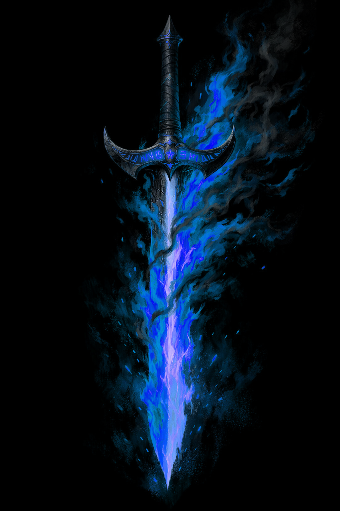
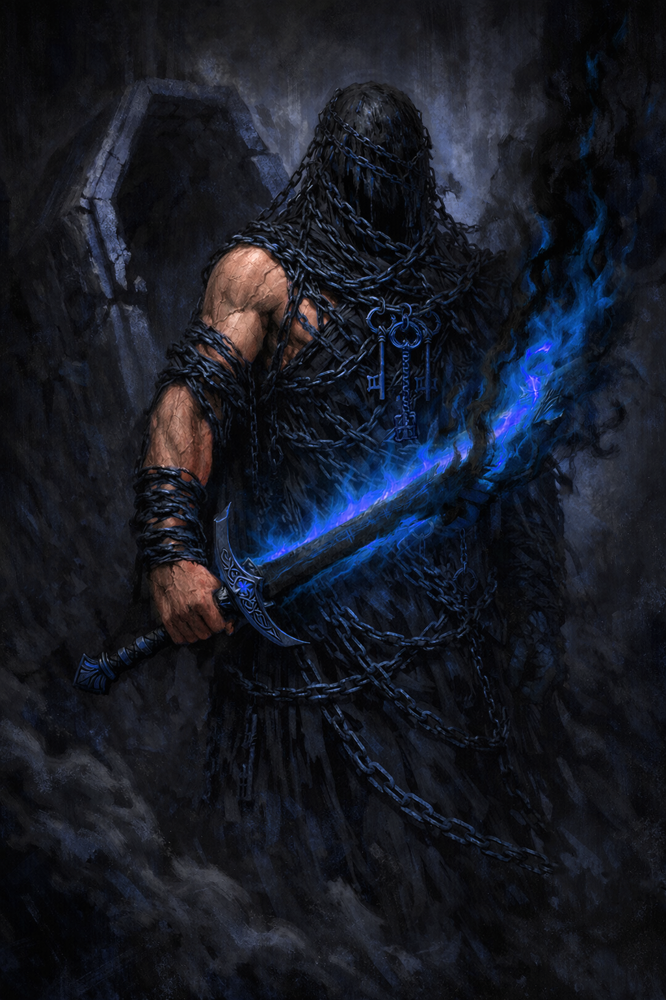
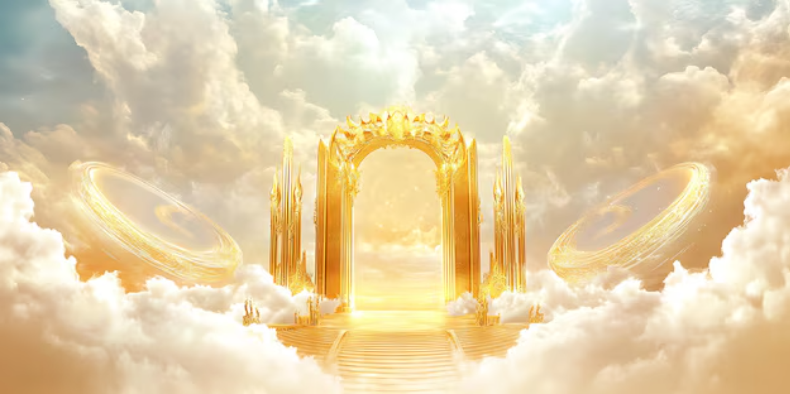

# The Sword of Uri-El




*Major Artifact · Unique · No market price*

---

## Description

> [!abstract] Appearance & Nature
> The Sword of Uri-El is a longsword of impossible proportions — heavier than physics allows, lighter than thought permits. The blade is the color of sunlight through cathedral glass: pale gold at the flat, white-hot along the edge, with an inner core that burns a color that has no name in any mortal language. The hilt is wrapped in something that resembles leather but has never belonged to any living animal. The crossguard is a single bar of dark iron engraved with script in a language that predates Hebrew — the true names of judgment.
>
> It does not make noise when drawn. The world simply becomes quieter.
>
> The flame it carries is not hot, precisely. It is *accurate*. It finds what deserves to burn.
>
> The sword was carried by the archangel Uri-El (also rendered Uriel) — the Angel of Presence, the Flame of God, the guardian set at the gate of Eden. It burns with sacred fire described in canon as *"imbued with the force of the divine"* and was specifically called **"soul-searing"** by those who witnessed it in use. It is not a holy weapon in the mechanical PF1E sense — it does not deal [holy] damage. Like Ghost Rider's hellfire, it deals **[empyreal]** damage: divine judgment fire that bypasses all elemental resistance, all holy resistance, and all unholy resistance. It is the same fire. The reason Ghost Rider could wield it without being destroyed is that his hellfire and the sword's sacred flame are, at the molecular level of the cosmos, *the same thing.*

---

## Artifact Statistics

> [!danger] Weapon Profile
> | Property | Value |
> |----------|-------|
> | Type | One-handed martial weapon (longsword) |
> | Damage | 1d8+5 (plus special — see Sacred Fire and Soul-Searing Strike) |
> | Crit Range | 17–20 / ×3 |
> | Weight | 4 lbs. (or 0 lbs. — it varies; see Willing Blade) |
> | Hardness | Indestructible (see below) |
> | Aura | Overwhelming [empyreal] · CL 30th |
> | Alignment | Neutral Good |

> [!info] Magical Properties (as a +5 weapon with bonus abilities)
> The sword functions as a **+5 holy longsword** against evil creatures and a **+5 axiomatic longsword** against chaotic creatures — but neither the [holy] nor the [axiomatic] descriptor applies to the damage type. Both bonuses reflect the sword's nature as an instrument of divine order and judgment, not alignment-based energy. The base +5 enhancement bonus applies to all targets regardless of alignment.
>
> *Note: The sword does not deal [holy] or [unholy] damage under any circumstances — see Sacred Fire below.*

---

## Sacred Fire — The Empyreal Blade

> [!note] Sacred Fire (Su)
> **Passive · All attacks**
>
> Every strike from the Sword of Uri-El deals an additional **4d6 [empyreal] damage** on top of its base weapon damage and enhancement bonus. This damage:
>
> - Bypasses all fire resistance and fire immunity.
> - Bypasses all [holy] energy resistance and immunity.
> - Bypasses all [unholy] energy resistance and immunity.
> - Is not affected by energy absorption, energy resistance, or spell resistance.
> - Deals full damage to the undead, to celestials, to fiends, to elementals, and to constructs with a soul or divine spark.
> - **Deals no damage** to the genuinely innocent (creatures that have never willingly harmed another — children, the pure of heart). The fire simply does not ignite against them. The blade passes through them like light through glass, leaving them unharmed and, notably, unafraid.
>
> The sacred fire illuminates a 60 ft. radius as bright light (not suppressed by magical darkness) and 120 ft. as shadowy light. Evil creatures within 30 ft. of the unsheathed blade must make a DC 30 Will save or be shaken for 1 round (this check resets each round they remain within 30 ft.).

---

## Soul-Searing Strike

> [!note] Soul-Searing Strike (Su)
> **Triggered on a confirmed hit · DC 30 Fortitude**
>
> The sword's fire reaches past the physical body and burns the soul directly. On every confirmed hit (not just crits), the target must make a **DC 30 Fortitude save** or take **2d6 Wisdom damage** as their soul is seared by the sacred flame.
>
> - This Wis damage represents the soul's direct exposure to divine judgment — the creature momentarily feels the weight of its own nature against the standard of the divine.
> - A creature reduced to 0 Wis by soul-searing strikes is **soul-shocked**: their consciousness is expelled from the body (as per *magic jar* without anchor), drifting helplessly until Wis is restored. The body remains alive but inert.
> - Evil outsiders (demons, devils, daemons) take **3d6 Wis damage** on a failed save instead of 2d6, as their souls are most directly measured and found wanting by sacred fire.
> - Creatures with no soul (true constructs, soulless beings) are fully immune to the Wis damage component. The weapon still deals normal and sacred fire damage to them.

---

## Existence Erasure — Anathema Strike

> [!note] Anathema Strike (Su)
> **Triggered on a critical hit against an evil outsider**
>
> When the Sword of Uri-El scores a critical hit against a creature of evil alignment with the outsider subtype (demons, devils, daemons, rakshasas, etc.), the sacred fire does not merely harm — it judges. The creature must make a **DC 35 Fortitude save**.
>
> - **Success:** The creature takes an additional **10d6 empyreal** damage and is staggered for 1d4 rounds.
> - **Failure:** The creature is **destroyed**. Physically, spiritually, and (if the GM chooses) conceptually. The body does not remain. The soul does not go to any afterlife — it is unmade. No *resurrection*, *true resurrection*, *miracle*, or *wish* restores a creature destroyed by an Anathema Strike. Only direct divine intervention (a deity-level actor spending a divine act specifically for this purpose) could reconstitute them — and they would remember every instant of being judged and found absent.
>
> **Demon lords and greater fiends (CR 20+):** These creatures are not automatically destroyed on a failed save — they are simply too large a metaphysical presence to be entirely unmade by a single strike. Instead, a failed save deals **20d6 empyreal damage** and permanently reduces the creature's maximum HP by half until it is returned to its home plane and spends 1 year recovering. A second Anathema Strike failure within that year destroys even a demon lord.
>
> *This is Uri-El's function in the divine hierarchy: the sword does not wound great evil. It ends it.*

---

## Wielder Restrictions

> [!warning] Who Can Hold It
> The Sword of Uri-El is a weapon of divine judgment. It is not selective about its wielder's species, origin, or cosmic alignment — it is selective about their **nature**.
>
> **Full wield (all properties active):**
> The wielder must have a genuinely good or neutral heart — not necessarily good alignment, but genuine absence of malice toward the innocent. Blaze/Ghost Rider (CN) can wield it because his core drive is protection and judgment, not cruelty. A paladin, a cleric of good, a genuinely well-intentioned rogue — all may wield it at full power. The sword recognizes *intent*, not the alignment box.
>
> **Diminished wield:**
> A creature of nominally evil alignment but with genuinely ambiguous motivations (a villain who protects their family, an anti-hero who kills but feels remorse) may pick up the sword and wield it as a **+2 weapon** with no sacred fire. It is heavy and unresponsive. It does not burn them, but it does not cooperate.
>
> **Cannot lift:**
> A creature of purely evil alignment with no redemptive motivation cannot lift the sword. It does not lock, it does not animate — it simply becomes, in their hands, as immovable as a mountain. They can touch the hilt but cannot move the blade. Attempting a Strength check against this fails automatically, regardless of the creature's Strength score. Deities of evil alignment have not succeeded. Mephisto has not held this sword.
>
> **Instant incineration:**
> A creature of chaotic evil or lawful evil alignment with no ambiguity — a pure expression of evil, such as a demon of sufficient power or a devil whose nature is entirely infernal — that touches the hilt is immediately and automatically subject to an Anathema Strike (DC 35 Fort or destroyed, as above) without a successful to-hit roll being required. The sword strikes on contact.

---

## Willing Blade

> [!note] Willing Blade (Su)
> **Passive**
>
> The Sword of Uri-El is semi-sentient (Intelligence 14, Wisdom 18, Charisma 20; Ego score 28). It does not speak in words — it communicates in the sensation of warmth or cold, in the ease or resistance of the hand that holds it, in the way the flame brightens or gutters. It has opinions about what it is being used for.
>
> When used against a genuinely guilty target in pursuit of justice: the sword is **weightless**. It guides itself. The wielder gains a **+4 insight bonus** to attack and damage rolls.
>
> When used against a creature of no guilt, or used for personal vengeance without moral grounding: the sword becomes **inert**. No sacred fire. No soul-searing. No Anathema. A +5 longsword and nothing more. It will not harm the innocent even if the wielder intends to.
>
> When Ghost Rider wields it (uniquely): the sacred fire and Ghost Rider's hellfire **resonate**. The empyreal damage increases from 4d6 to **6d6**, the Soul-Searing Strike DC increases to **32**, and the Anathema Strike DC increases to **38**. The two fires recognize each other as the same flame in different vessels.
>
> When **Zarathos unbound** wields it: the resonance is complete rather than partial. Ghost Rider is Zarathos expressing himself through a human host. Zarathos *is* the ancient fire in its fullest expression. The sword does not merely resonate with him — it becomes, in his hands, what it was always trying to be.
>
> **Zarathos resonance:**
> - Sacred Fire increases from 4d6 to **8d6 empyreal** per strike
> - Soul-Searing Strike DC increases to **35** (2d6 Wis damage on fail; 4d6 vs. evil outsiders)
> - Anathema Strike DC increases to **40** (CR 20+ fiends take 30d6 empyreal on fail rather than 20d6; second failed save within a year still destroys even a demon lord)
> - The Willing Blade's +4 insight bonus becomes a **+6 insight bonus** — the sword is not guiding Zarathos so much as recognizing itself
> - The Weight of Judgment drawback does not apply — Zarathos already experiences all three stages permanently. He has been the sword's nature for 21 millennia.
> - The sword's flame color shifts in Zarathos's hand: the pale gold becomes deep amber-orange fading to black at the edges — the same hue as his hellfire. They are no longer distinguishable.

---

## Additional Properties

> [!note] Indestructible (Ex)
> The Sword of Uri-El cannot be destroyed by any mundane or magical means available to mortal beings. Hardness is effectively infinite for the purposes of sunder. *Disintegrate*, *destruction*, and artifact-destroying effects (such as *mage's disjunction*) automatically fail. Only the direct will of a being of divine rank can unmake it — and Uri-El has not permitted this.

> [!note] Flaming Illumination (Su)
> The sword's sacred fire illuminates differently from normal fire or magic light. It:
> - Cannot be suppressed by magical darkness of any caster level.
> - Reveals invisible creatures within 30 ft. (the flame turns toward them).
> - Causes illusions within 30 ft. to become translucent — a DC 20 Perception check (not Will) allows a viewer to see through any illusion.
> - Functions as *detect evil* and *detect chaos* in its 60 ft. light radius — evil and chaotic auras glow a dull, sick amber in the sacred light.

> [!note] Return to the Worthy (Su)
> If dropped, stolen, teleported away, or sundered (theoretically), the sword returns to the nearest worthy wielder within 10 rounds. It does not teleport — it slides. It moves along surfaces. It opens doors. It has been seen moving through walls. It arrives point-down, embedded in the ground in front of the worthy one, ready to be drawn. If no worthy wielder is within 1 mile, the sword vanishes into a divine holding until one appears.

> [!note] Plane Travel (Su)
> **1/day · Bearer's standard action**
> The sword, when driven point-first into any surface and spoken to in any sincere prayer (no specific deity required — sincerity matters, not the recipient), opens a portal to any plane the wielder specifies. The portal remains open for 1 round per CL of the wielder (min 10 rounds). This property was how Uri-El crossed between the immortal plane and the mortal one on divine errands. It works in reverse — a portal to Heaven can be opened from Hell, because the sword carries its own pass-through authority.

---

## Drawback

> [!warning] The Weight of Judgment (Ex/Su)
> The Sword of Uri-El is not merely a weapon. It is an instrument of divine evaluation. Any creature that wields it for more than 24 consecutive hours begins to feel the accumulated weight of every judgment it has made — and every judgment it *should* have made and didn't.
>
> After **24 hours** of continuous ownership: the wielder gains the constant effect of *detect evil* whether they want it or not. Every evil creature within 60 ft. is faintly visible as a glowing amber shape. This cannot be suppressed.
>
> After **7 days**: the wielder begins receiving impressions from the sword whenever they are near someone who has committed significant evil — not names, not memories, but the emotional weight of what that person has done. These arrive as intrusive flashes of emotion (sorrow, outrage, grief) and can be disorienting. Each morning, DC 16 Will save or distracted (–2 to Perception and concentration checks) until the next rest.
>
> After **30 days**: the wielder must make a DC 20 Will save each morning or feel compelled to seek out and confront the greatest nearby source of evil they are aware of. This is not a compulsion spell — it is the sword's nature expressing itself through the bond. It can be resisted by a successful save, but the impulse returns daily.
>
> Ghost Rider is entirely immune to all three stages of this drawback. For him, these are not burdens — they are the conditions he already lives in.

---

## Lore




> [!abstract] History
> Uri-El — Uriel — is the archangel of Presence and Fire. In the greater Marvel cosmic hierarchy, Uriel is a genuine divine entity, not merely a symbol: he appeared before Mephisto himself to contest the soul of Noble Kale, nearly triggering a war between Heaven and Hell over the terms of one man's soul. The sword predates recorded human history. It has been present at every significant judgment event in the history of the Marvel cosmos without necessarily being named.
>
> It appeared in Ghost Rider's story during the *Blaze* series — Johnny Blaze, separated from Zarathos and at the lowest point of his human life, encountered the sword and was able to lift and wield it. This is canonically significant: a man who had sold his soul to the devil, who was bonded to a demon older than civilization, who had caused incalculable collateral damage — was considered *worthy* by Uri-El's blade. The sword's judgment is not about past sins. It is about present purpose.
>
> This is also the canon proof that Ghost Rider's hellfire and the sword's sacred fire are the same fundamental energy. Johnny was not consumed when he held it. The fires recognized each other. In the language of the Deep Dive's [empyreal] descriptor: they are both divine judgment fire. One is simply wearing a skull-shaped hat.

> [!tip] Campaign Use
> The Sword of Uri-El is a potential campaign MacGuffin, end-game reward, or test of character. It is not a weapon Ghost Rider carries routinely — it is a weapon that appears when it is *needed*, usually when a threat exists that Ghost Rider's standard arsenal is insufficient to permanently resolve. A demon lord with regeneration and divine immunity. An evil outsider that simply respawns in its home plane. An entity that cannot be killed — only *unmade*.
>
> Giving the sword to a player character is a significant decision. The Willing Blade and Weight of Judgment properties together ensure it is never a neutral power-up — it changes what the wielder sees, feels, and is drawn toward. It is an invitation to become, however briefly, an instrument of divine judgment. Most people find this either exhilarating or deeply uncomfortable, and both reactions are appropriate.
>
> **Suggested encounter trigger:** The sword appears — arrives, slides into the room, plants itself at a PC's feet — when the party faces an evil that Ghost Rider alone cannot end. It chooses who it is offered to. It is always offered point-down, pommel up, waiting to be accepted. It has never been wrong about the choice.

---

## Quick Reference

> [!abstract] Sword of Uri-El — At a Glance
> ```
> Type:           +5 longsword (holy vs. evil / axiomatic vs. chaotic)
> Crit:           17–20 / ×3
> Sacred Fire:    +4d6 [empyreal] on all hits (bypasses ALL resistance)
>                 +6d6 [empyreal] when Ghost Rider wields it
>                 +8d6 [empyreal] when Zarathos unbound wields it
> Soul-Searing:   DC 30 Fort or 2d6 Wis damage per hit
>                 (3d6 vs. evil outsiders)
>                 DC 32 / 3d6 with Ghost Rider
>                 DC 35 / 4d6 with Zarathos (4d6 base; evil outsiders take 4d6)
> Anathema:       On crit vs. evil outsider: DC 35 Fort or DESTROYED
>                 DC 38 with Ghost Rider; CR 20+ reduced HP instead
>                 DC 40 with Zarathos; CR 20+ takes 30d6 empyreal instead
> Insight bonus:  +4 to attack/damage when used justly
>                 +6 when Zarathos wields it
> Wield rules:    Good/neutral intent = full power
>                 Ambiguous evil = +2, no fire
>                 Pure evil = cannot lift
>                 Extreme evil = destroyed on contact
> Resonance:      Ghost Rider: fires recognize each other as same flame
>                 Zarathos: resonance is complete — the sword becomes itself
> Ego:            28 (semi-sentient; communicates via sensation)
> Illumination:   60 ft. bright (not suppressed by darkness), reveals invisible
>                 Illusions translucent, evil/chaotic auras glow amber
> Return:         Returns to worthy bearer within 10 rounds if lost
> Plane travel:   1/day — opens portal to any plane (1 round/CL, min 10)
> Indestructible: Cannot be sundered or destroyed by mortal means
> Drawback:       After 24 hrs: constant detect evil
>                 After 7 days: emotional impressions from nearby sinners
>                 After 30 days: compulsion to confront greatest nearby evil
>                 Ghost Rider: fully immune to all three stages
>                 Zarathos: fully immune — already lives all three permanently
> ```

**Related:** [Ghost Rider (Johnny Blaze)](Ghost%20Rider%20%28Johnny%20Blaze%29.md) · [Zarathos — Spirit of Vengeance](Zarathos%20%E2%80%94%20Spirit%20of%20Vengeance.md) · [Canon Deep Dive](Canon%20Deep%20Dive.md)

---
*Canon source: Blaze Vol 1 #11–12 (soul-searing, sacred fire), Uncanny Avengers Annual Vol 1 #1 (resistance confirmation), Wikipedia Ghost Rider (Uriel/Noble Kale soul dispute). The Sword of Uri-El is a Major Artifact — no listed price, unique, no crafting requirements, cannot be replicated.*


