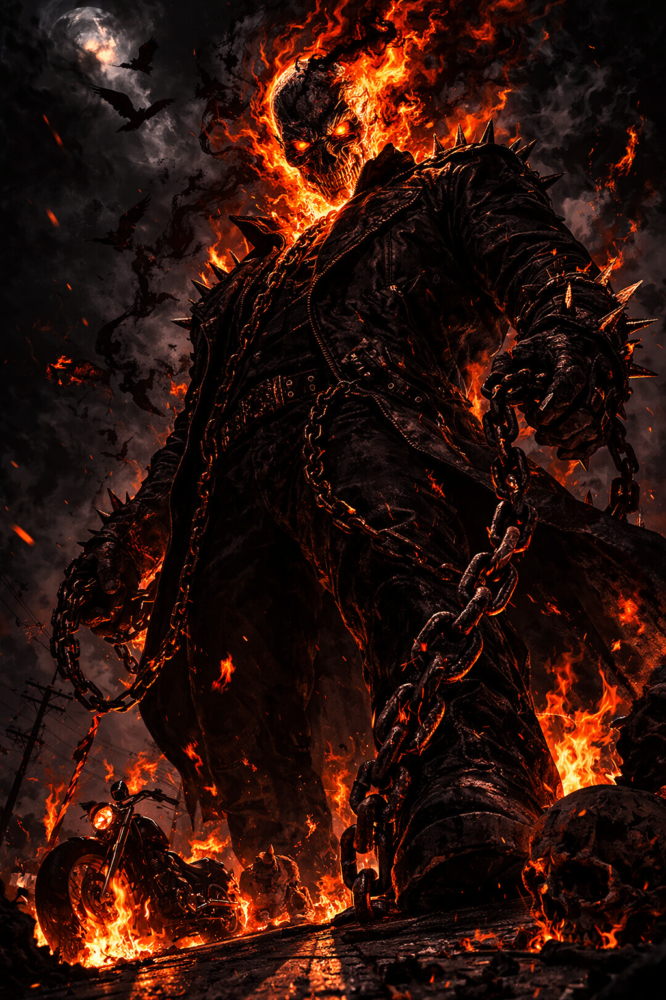
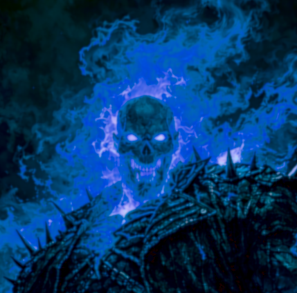

# Ghost Rider — Canon Deep Dive & Design Notes

This document is the reference sheet for the Ghost Rider ensemble. It covers three things: (1) the custom **[empyreal]** damage descriptor, (2) a comprehensive canon ability inventory sourced from the deep dive, and (3) designer notes explaining each of the 18 revision decisions made in v2 of the stat blocks.

---

## The Empyreal Descriptor

> [!abstract] Custom PF1E Damage Descriptor — [Empyreal]
> **Canon basis:** Multiple Marvel sources describe Ghost Rider's hellfire as *"empyreal"* — from the Empyrean, the highest heaven. It is divine judgment fire. Specific canon citations:
> - VS Battles Wiki: *"Hellfire is an empyreal and supernatural flame that burns the soul of a person and can be used to burn their physical body."*
> - Canon feat: Ghost Rider wielded the Sword of Uri-El (angel sword of sacred fire) without being harmed — because his hellfire and the sword's fire are the same fundamental thing.
> - Canon feat: Lucifer's demonic power could not bind Ghost Rider's soul to Hell because the Spirit of Vengeance is a heavenly entity.
> - Canon feat: Ghost Rider's hellfire works equally against demons (who would be immune to holy fire) and angels (who would be immune to unholy fire).
>
> **Conclusion:** Hellfire is neither the [holy] nor the [unholy] descriptor. It is a third thing — divine judgment, operating outside the good/evil axis.

### Empyreal Descriptor Rules

> [!info] [Empyreal] Damage Rules
> | Property | Rule |
> |----------|------|
> | **Fire resistance** | Bypassed completely — [empyreal] is not fire |
> | **Fire immunity** | Bypassed completely |
> | **[Holy] resistance/immunity** | Bypassed completely |
> | **[Unholy] resistance/immunity** | Bypassed completely |
> | **Energy resistance (general)** | Does not apply |
> | **Soul-based immunity** | The only resistance that matters is immunity to divine judgment |
> | **Immune: True constructs** | Immune — no soul to burn |
> | **Immune: The genuinely innocent** | Immune — nothing to judge |
> | **Immune: The soulless** | Immune — Centurious-type; this is also Zarathos's hard counter |
> | **Reduced damage: Good creatures** | At GM's discretion, a creature of purely good alignment may take half damage — their soul is "cleaner" and the fire finds less purchase. Not a rule, a suggestion. |
> | **Full damage: All evil creatures** | Always full damage, no saves bypass the empyreal component |
> | **Full damage: Neutral creatures** | Always full damage |
> | **Resistance option** | Only a custom "immunity to divine judgment" trait negates it — this does not exist in core PF1E and would require GM creation |
>
> **In practice:** [Empyreal] damage simply goes through everything. When Ghost Rider attacks a demon lord immune to fire, immune to unholy damage, and immune to evil effects — all of that is irrelevant. The empyreal descriptor ignores all of it. This reflects the canon fact that Ghost Rider can credibly threaten Mephisto himself.

---

## Canon Ability Inventory

A comprehensive reference of Ghost Rider/Zarathos abilities confirmed from canon research, with implementation notes for each.

### Hellfire Abilities

> [!info] Hellfire — Canonical Forms
> | Ability | Canon Source | PF1E Implementation |
> |---------|-------------|---------------------|
> | Hellfire blast (hands/eyes/mouth) | All sources | Ranged touch attack, 8d6 empyreal |
> | Hellfire breath / cone | Wikipedia: *"hellfire breath"* added to Blaze's repertoire | 6d8 empyreal, 30 ft. cone, 3/day |
> | Hellfire nova (burst) | VS Battles: makes Hulk scream, terrifies Strange | 10d6 empyreal, 30 ft. burst, 1/day |
> | Hellfire walls / constructs | Multiple: *"form walls of hellfire"* | Trail of Hellfire (10 ft. wide × 15 ft. tall) |
> | Hellfire telekinesis | VS Battles: *"Telekinesis (via Hellfire)"* | Included in SLA list |
> | Hellfire shotgun channel | Marvel.com, Wikipedia | Hellfire blast variant; weapon applies empyreal descriptor to any fired weapon |
> | Create motorcycle from hellfire | Multiple sources | Hellcycle recall/reform ability |
> | Cold hellfire (soul-burn, no heat) | FASERIP: *"cold hellfire that affects the human spirit"* | Cold Hellfire Touch — 4d6 Wis damage |
> | Hellfire imbue (infuse object/weapon) | Multiple | SLA / Su — hellfire spark (human form), Hellcycle wheels |

### Physical Abilities

> [!info] Physical & Combat Abilities
> | Ability | Canon Source | PF1E Implementation |
> |---------|-------------|---------------------|
> | Superhuman strength | All: can flip freight trains, pull skyscrapers | STR 39 (Ghost Rider) / STR 48 (Zarathos) |
> | Limitless stamina | VS Battles: *"mystical energy prevents fatigue toxins"* | Immune to fatigue and exhaustion |
> | Size alteration | VS Battles: *"Grew in size when fighting Thor"* | SLA: enlarge person (self) — suggested addition if GM wants |
> | Hellfire chain (summon/dismiss) | All sources — signature weapon | Hellfire chain, +4 anarchic flaming burst spiked chain, empyreal damage |
> | Chain: variable length | Marvel DB: *"upper limits are unknown"* | Reach 20 ft. with Lunge; GM may rule unlimited in narrative contexts |
> | Chain: transforms into other weapons | Marvel DB | Sunder, disarm, whip, staff — GM adjudication |
> | Chain from chest/throat | Wikipedia: *"chains from either his throat or chest"* | Cosmetic / narrative only; same mechanical effect |
> | Brimstone impact (dive attack) | Multiple: launches from buildings, shatters concrete, overturns cars | Brimstone Impact (Su), 1/day, 20d6 empyreal + 10d6 bludgeoning |
> | Shattered ground / stalagmites | Wikipedia: Zarathos *"rupture the ground...spiked stalagmites"* | Brimstone Upheaval (Zarathos only) |

### Soul Abilities

> [!info] Soul Manipulation
> | Ability | Canon Source | PF1E Implementation |
> |---------|-------------|---------------------|
> | Penance Stare | All: *"relive every pain they ever inflicted"* | Penance Stare + Judgment Lock — DC 40 Will; GR: 4d4 Wis/round fail, 1 flat success; Zarathos: 5d4 fail, 1 flat success |
> | Penance Stare: catatonia | Marvel.com: *"permanently catatonic"* | 0 Wis = permanently catatonic; soul consumed if Ghost Rider chooses |
> | Damnation Stare | Marvel DB: King of Hell ability — sends demons straight to Hell | Not statted — reserved for Johnny as King of Hell variant |
> | Soul consumption | All: *"the more souls he consumes, the more powerful he becomes"* | Soul Consumption (Su) — 50 hp + profane bonus per soul |
> | Soul rend (via bite) | FASERIP + lore | Soul Rend — Cha drain to 0 = soul-dead |
> | Soul binding chain | Multiple: chain pins soul, not body | Soul Binding — paralyzed, no escape magic, –8/–10 penalty to magic |
> | Soul command/compel | VS Battles, Character Level Wiki | SLA: suggestion (evil only) |
> | Soul perception (read object history) | Versus Compendium: *"read the history of objects"* | Burning Judgment Eyes — sin sight; object reading at GM discretion |
> | Soul purge/cleanse | Screen Rant: Danny Ketch's version heals souls | Not present in Blaze/Zarathos — this is Danny Ketch's variant |
> | Exorcism | Marvel DB | Banishment SLA (demons only) |

### Supernatural Senses

> [!info] Senses
> | Ability | Canon Source | PF1E Implementation |
> |---------|-------------|---------------------|
> | Detect evil | All | Constant SLA |
> | Sin smell | Multiple: *"literally smell sins...from miles away"* | Scent Sin (Su) — unlimited range same plane |
> | Sin sight (gaze) | VS Battles: *"determine what kind of sin by reading their mind, heart, and soul"* | Burning Judgment Eyes |
> | True seeing | Multiple | Constant (Burning Judgment Eyes) |
> | Supernatural awareness | Multiple | Cannot be surprised by evil; cannot be flanked by evil |
> | Psychometry | Marvel DB: *"learned the identity of a late host by looking"* | Burning Judgment Eyes — object reading variant |
> | Detect supernatural | Hulk Wiki: *"detect any supernatural occurrences"* | Burning Judgment Eyes / aura sight |
> | Feel sin/fear/pain (empathic) | VS Battles: *"demonstrated the ability to feel sins, fear, pain"* | Sense Motive bonus; narrative tool |

### Movement & Travel

> [!info] Movement Abilities
> | Ability | Canon Source | PF1E Implementation |
> |---------|-------------|---------------------|
> | Hellcycle: outpaces Mjolnir | Multiple: *"faster than Thor's Mjolnir"* | True speed: unlimited/supernatural (500 mph overland) |
> | Hellcycle: all terrain | Multiple | All-terrain movement — no terrain penalty |
> | Hellcycle: vertical surfaces | Multiple | Included |
> | Hellcycle: water surface | Multiple | Included |
> | Hellcycle: jump arc | Depicted canonically as massive arcs off buildings | GM adjudication — parabolic arc, no hard cap |
> | Hellcycle: self-propelled | Multiple: *"never requires fuel"* | Supernatural propulsion |
> | Teleportation | Multiple: Zarathos and Alejandra both teleport | Plane shift SLA (self + Hellcycle) |
> | Dimensional travel | VS Battles: *"cross between immortal/celestial plane and mortal"* | Plane shift SLA |
> | Portal creation | VS Battles | Included in gate SLA (Zarathos) |

### Magical & Cosmic Abilities

> [!info] Magic & Cosmic
> | Ability | Canon Source | PF1E Implementation |
> |---------|-------------|---------------------|
> | Summoning other Ghost Riders | Multiple | Not statted — narrative/campaign tool |
> | Possession | Multiple | Magic jar equivalent (Zarathos) |
> | Resurrection (limited) | Multiple | Undying (Ex/Su) |
> | Statistics reduction | VS Battles: *"weaken magical enhancements"* | Chain of Damnation: suppress all buffs |
> | Tongues / all languages | Inferred from 21,000+ years of hosts | Tongues (constant Su) — added to Zarathos |
> | Weather manipulation | VS Battles: Alejandra (Zarathos variant) | Brimstone Upheaval thunderstorm variant |
> | Time travel | VS Battles: two Ghost Riders travel back in time | Not statted — plot device only |
> | Space survival | VS Battles: Vengeance (kindred entity) survives space | Not statted — narrative only |
> | Immunity to death manipulation | Multiple: shrugs off instant-death attacks | Immune to death effects |
> | Anti-transmutation | VS Battles: Skin-Bender cannot affect his flesh | Immune to transmutation (Ghost Rider form) — suggested addition |

---

## Designer Notes — The 18 Revisions

> [!tip] Revision Log
> | # | Issue | Resolution | Canon Basis |
> |---|-------|-----------|-------------|
> | 1 | Hellcycle max speed | Added "true speed: supernatural/unlimited (500 mph overland)" as distinct from 120 ft. tactical | *"Faster than Thor's Mjolnir"* — multiple sources |
> | 2 | Jump arc 30×20 ft. cap | Removed cap entirely; GM adjudicates parabolic arc | Depicted crossing city blocks, launching from skyscrapers |
> | 3 | Unholy damage type | Replaced with [empyreal] custom descriptor — bypasses all fire, holy, and unholy resistance/immunity | *"Empyreal and supernatural flame"* — every major source |
> | 4 | Zarathos communication | Added Tongues as constant Su | 21,000+ years of hosts across every culture |
> | 5 | Chain entangle → soul binding | Chain now causes paralysis + no escape magic + buff suppression; no grapple check | Chain obeys mental commands, *"cuts through almost anything"*, binds soul not body |
> | 6 | Unholy Aura → appropriate auras | Replaced with: **Aura of Existential Dread** (soul-based supernatural dread with Soul Awareness Tier system — see stat blocks) + Burning Judgment Eyes + Smoldering Presence. Holy Aura as Zarathos Surge 1/day. | Ghost Rider is a heavenly entity; Lucifer's power could not bind him; standard fear immunity bypassed by soul-based typing |
> | 7 | Withering/wilting effect | Added Smoldering Presence (Su) — passive atmospheric, 30 ft. radius | Depicted in comics; flowers blacken, darkness deepens |
> | 8 | Wish must serve evil | Corrected to: wish must serve vengeance or justice, never evil, never Mephisto's agenda | Ghost Rider's core drive is judgment, not evil |
> | 9 | Missing feats | Added Cleave, Great Cleave (mowing crowds), Diehard (will not stop), Stand Still (chain pins targets), Lunge (20 ft. chain reach), Furious Focus (relentless pressure), Improved Disarm (chain strips weapons) | Combat behavior in comics; *"force of nature"* archetype |
> | 10 | Penance Stare can be broken | Added Judgment Lock — paralyzed, cannot break contact through willpower; only external physical intervention ends it | Marvel.com: *"permanently catatonic"*; once locked, mortals cannot resist |
> | 11 | Trail height unspecified | Added 15 ft. height | Logical inference: 10 ft. wide flame at 15 ft. height cannot be jumped or low-flown |
> | 12 | No dive/impact ability | Added Brimstone Impact (Su) 1/day — 20d6 empyreal + 10d6 bludgeoning, 30 ft. radius, DC 30 Ref half, shatters terrain, overturns vehicles | Depicted multiple times: launches from buildings, lands like bunker buster |
> | 13 | Blaze's Will had CR cap | Removed CR cap entirely; Johnny can resist any entity's command at any CR | Canon: tricked Mephisto; the One Above All sealed the bond; Strange is *terrified* of what Johnny can do when his will is set |
> | 14 | Unbreakable Bond — background only | Added as a formal Ex ability with mechanical consequences (Mephisto cannot alter terms, bond non-transferable, Zarathos cannot be stolen) | Zadkiel's intervention; later revealed God's authority; Mephisto uses proxies precisely because the bond prevents direct action |
> | 15 | Alter ego feats incomplete | Added Diehard, Endurance, Indomitable Faith, Nerves of Steel, Toughness | Johnny has survived things that break ordinary men; *"uncommon fortitude"* |
> | 16 | Gear not specified | Added Hell-Tempered Leathers: +2/+3 leather armor, fire immune, indestructible to mundane weapons, cannot be removed while bonded | Depicted: jacket never burns, never tears in combat |
> | 17 | No human-form spark | Added Hellfire Spark (Su) — free action, prestidigitation-level orange-black flame, no damage, no transformation | Depicted: Johnny produces small flames from Zarathos's power without transforming |
> | 18 | No street smarts | Added Nine World Records trait (+4 Ride), Street Smarts Ex (+4 Bluff/Perception/Sense Motive in urban/road), Occult Scholar Ex (+4 arcana/religion/planes vs. demons/contracts/hellfire), Knowledge (local) +18, Profession (stunt rider) +22 | VS Battles: *"nine Guinness World Records"*, *"incredibly street smart"*; Strange considers him potential Sorcerer Supreme candidate |

---

## Notable Canon Feats (for Encounter Calibration)

> [!warning] Power Reference
> These are confirmed canon feats used to calibrate the CR 19 (composite) and CR 26 (Zarathos unbound) assignments.
>
> | Feat | Implication |
> |------|------------|
> | Made Hulk (World War Hulk) scream in pain with Hellfire Nova — with Zarathos in control | Zarathos unbound ≈ WWH-tier, which is why CR 26 (near demon lord) is correct |
> | Doctor Strange was *terrified* when Blaze lost control — said Zarathos could defeat WWH | Composite at Zarathos Surge = CR 21+; unbound = CR 26–28 |
> | Defeated all Avengers in combat | Composite CR 19 is consistent — A-list Avengers are roughly CR 15–18 individually |
> | Rogue was unable to drain Ghost Rider's powers — they consumed her instead | SR 30 reflects this; power drain immunity could be added as Su immunity |
> | Fought Thor repeatedly to a draw | CR 19 is appropriate; Thor is roughly CR 20–22 depending on form |
> | Survived Doctor Voodoo (Sorcerer Supreme) spell unharmed | SR 30 + Will +16 consistent |
> | Wielded Sword of Uri-El (angelic sacred fire) without being consumed | Confirms empyreal nature of hellfire — same fundamental energy as divine fire |
> | Lucifer's demonic power could not bind Ghost Rider's soul to Hell | Confirms heavenly entity status; immune to soul-trapping by demonic means |
> | Blaze holds nine Guinness World Records for stunt riding | Nine World Records trait |
> | Considered Sorcerer Supreme candidate by Doctor Strange | Occult Scholar trait; high Knowledge (arcana/religion/planes) |
> | Skin-Bender (a transmutator) could not affect his flesh — it burned her | Suggested immunity to transmutation while transformed |

---

## Aura Selection — Designer Commentary

> [!tip] Why These Auras?
> The user raised this question explicitly, presenting several options. Here is the full reasoning:
>
> **Removed — Unholy Aura:** Incorrect on two levels. First, it's the wrong alignment (Ghost Rider is CN, and even Zarathos's power is empyreal, not unholy). Second, Unholy Aura gives a defensive bonus to evil creatures — the exact opposite of what Ghost Rider does. Evil creatures should be *more* afraid of him, not protected by his presence.
>
> **Added — Aura of Righteous Terror:** Combines the Aura of Dread and the Fearless Aura in one package. Evil creatures are frightened; non-evil creatures are shaken; Ghost Rider's designated allies are immune to fear within 30 ft. This is mechanically elegant and thematically perfect — Ghost Rider is terrifying to the guilty, and his allies fight without fear in his presence.
>
> **Added — Burning Judgment Eyes:** This is the Aura Sight suggestion the user raised, plus more. The glowing skull eyes are not decorative — they are always-on divine perception that include true seeing, sin sight, detect evil, and supernatural awareness. Not technically an "aura" but it belongs in this discussion.
>
> **Added — Smoldering Presence:** The withering/wilting effect. Purely atmospheric, no mechanics, but crucial for describing Ghost Rider's presence in play. It is always the first sign he's nearby.
>
> **Recommended as Surge Upgrade — Holy Aura:** Active 1/day, auto-activates when Zarathos Surges. This is the moment when Ghost Rider's true heavenly nature overwhelms the demonic shell. It is the most powerful version of his divine nature and should feel exceptional, not routine.
>
> **Not Added — Death Knell Aura:** Interesting, but Death Knell affects creatures near death (below 0 hp in PF1E, dying in 3.5). Ghost Rider tends to fight creatures that are at full HP and very hard to kill. The effect would rarely trigger. Recommend as a optional homebrew addition for GMs who want a more necromantic flavor — *Greater Death Knell Aura* that triggers when Ghost Rider delivers a killing blow, consuming the soul automatically, would be an excellent combo with Soul Consumption. Consider adding to the Zarathos Surging dial.
>
> **Not Added — Flaming Aura (generic):** Subsumed entirely by Hellfire Aura with the [empyreal] descriptor. A generic flaming aura would be a strict downgrade.

---

## Encounter Design Reference

> [!info] Three-Tier Threat Matrix
> | Opponent Type | Ghost Rider's Edge | Ghost Rider's Risk |
> |--------------|-------------------|-------------------|
> | Demons / Devils | Empyreal damage bypasses all immunity; Penance Stare works on any soul; Righteous Terror frightens them | DR 15 from high-end fiends; strong Will saves may resist stare |
> | Angels / Celestials | Empyreal damage still works (divine judgment fire respects no alignment); Righteous Terror still applies | Heaven-forged weapons suppress regen; Holy creatures may have high Will saves |
> | Mortals | Almost unlimited — Penance Stare, Trail of Hellfire, Brimstone Impact designed for crowds | Genuinely innocent mortals are immune to almost everything |
> | Soulless beings | Severely hampered — Penance Stare, Soul Rend, Soul Binding all fail; –4 to attacks within 30 ft. | This is his hard counter — the Centurious exploit |
> | Demon Lords (Mephisto tier) | Empyreal damage works; can fight at his level; Blaze's Will cannot be overridden | These encounters are intended to be brutal; Zarathos Surge mode required |

---
*This document synthesizes research from: Marvel Database (marvel.fandom.com), VS Battles Wiki, Wikipedia (Ghost Rider, Zarathos, Ghost Rider's Chain articles), Screen Rant, Character Level Wiki, Versus Compendium, Classic Marvel Forever (FASERIP stats), and Marvel.com official character page.*
