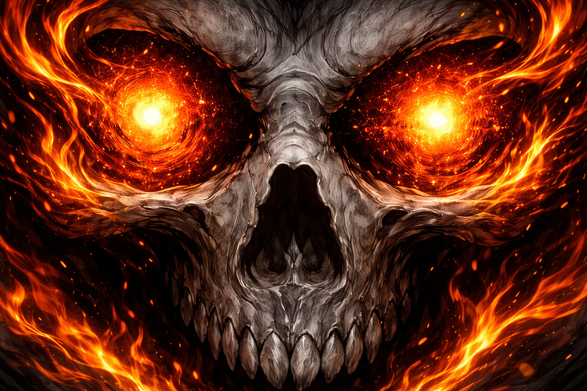
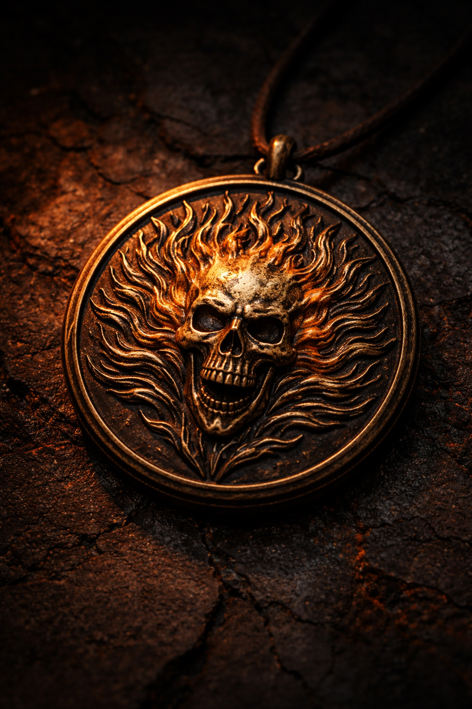
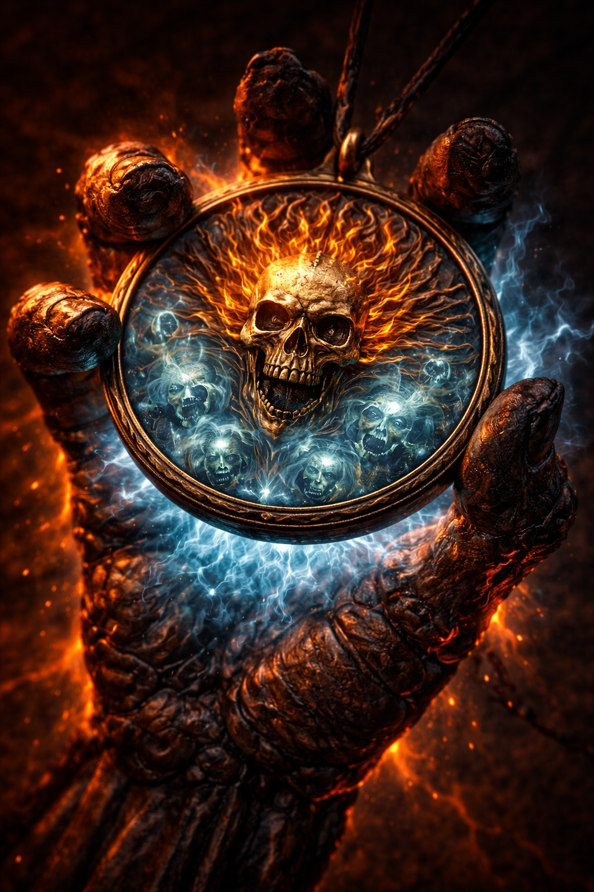

# Spirit of Vengeance — Class Guidebook

> *"It's said that the West was built on legends. Tall tales that help us make sense of things too great or too terrifying to believe. This is the legend of the Ghost Rider. Story goes that every generation has one. Some damned soul, cursed to ride the earth, collecting on the Devil's deals."*
> — Carter Slade, the Caretaker

---

## Table of Contents

- [The Legend](#the-legend) — What you're getting into
- [What You Are](#what-you-are) — Host, Rider, Spirit
- [Class: Spirit of Vengeance](#class-spirit-of-vengeance) — Chassis, progression table, proficiencies
- [Class Features](#class-features) — Every feature, level by level
- [Part 3: Hellfire Instability](#part-3-hellfire-instability--the-d100-table) — The d100 table
- [Part 4: Damage Parity](#part-4-damage-parity--making-sure-the-rider-belongs-at-the-table) — Benchmarks vs Fighter/Barbarian
- [Part 5: The Ancient Fire](#part-5-the-ancient-fire--zarathos-surges) — Zarathos surge rules
- [Part 6: Foundry VTT](#part-6-foundry-vtt-implementation) — Digital sheet setup
- [Quick Reference Card](#quick-reference-card) — All DCs and formulas at a glance
- [Part 7: DM Guide](#part-7-dm-guide--running-the-spirit-of-vengeance) — Scene framing, Dread, Penance, the Golden Rule
- [Part 8: Player Tips & Tactics](#part-8-player-tips--tactics) — How to actually play this
- [Part 9: Building Your Host](#part-9-building-your-host) — Sample builds, feat paths, multiclass
- [Part 10: Alternative Flavors](#part-10-alternative-flavors) — Different hosts, different settings, different spirits
- [Part 11: FAQ](#part-11-faq) — The confusing stuff, answered
- [Paizo Reference Index](#paizo-reference-index) — Where to find the rules we reference
- [Legal Notice](#legal-notice) — OGL/ORC

---

## The Legend

Long ago, the Medallion of Power was forged by the ancient cult known as The Blood to house entities called the Spirits of Vengeance — angels of justice, sent to protect the world of men. The arch-demon Mephisto coveted the Medallion and its Spirits. He trapped the most powerful of them — **Zarathos**, the Ancient Fire, the Ravager of Souls — stole his memories, and bound him into human hosts across the millennia. Each generation, a new Rider. Each Rider, a new war between the fire and the soul that carries it.

The deal is always the same. Someone desperate, someone young, someone willing to trade everything for one person they love. The contract is signed in blood — sometimes literally, sometimes by accident, always binding. And then the fire comes, and the skull burns, and the Rider walks the earth again.

The Spirits of Vengeance are not demons, though they wear the skin of damnation. They are not angels, though they carry heaven's flame. They are something older and more terrible than either — **divine judgment given a spine and a motorcycle and an extremely bad attitude.**

*"Zarathos was an angel, a Spirit of Justice. Sent to protect the world of men."*
— Moreau, *Ghost Rider: Spirit of Vengeance*

---

## What You Are

You are the **Host**. Something old and furious lives inside you — a Spirit of Vengeance, bound to your soul through pact, inheritance, curse, or cosmic misfortune. Most of the time, you are simply a person. You eat breakfast. You sharpen your sword. You argue about the tavern bill. You smell faintly of brimstone in warm weather, and you have learned to wear dark glasses indoors, because your eyes glow orange-black when something evil is nearby. Which is most of the time.

Then innocent blood is spilled, and the thing inside you wakes up.

When the Rider manifests, your flesh burns away. Your skull catches fire. Your weapon ignites with empyreal flame — a supernatural fire that burns the soul of the guilty and scorches the physical body of everything else. You become a walking judgment, a nightmare wrapped in hellfire that hunts the wicked and terrifies everything else in the room. Plants wilt. Water steams. Animals flee. Every candle in the building goes out at once.

You are still *you* in there. Mostly. But the fire has opinions, and sometimes it acts on them whether you like it or not.

> *"He may have my soul, but he doesn't have my spirit."*
> — Johnny Blaze

Push too hard, lose control, and the Ancient Fire takes the wheel. That is **Zarathos** — the Fallen, the Ravager, the fire that burned before recorded history. Doctor Strange, the Sorcerer Supreme himself, described Zarathos unbound as possessing power that is, for all intents and purposes, *"godlike."* He is not your friend. He is not your enemy. He is the thing you are keeping on a leash, and the leash is made of your willpower and not much else.

**The Host** is your character. You level them normally — pick feats, skills, weapons, whatever you like. Human is the canon choice (stunt riders, drifters, circus folk who made deals with devils at seventeen), but any race works. The Spirit doesn't care what you were before it found you.

**Ghost Rider** is what happens when you transform. A class feature, not a separate creature. Your greatsword still works. Your feats still apply. You just also happen to be a flaming skeleton draped in hellfire chains who terrifies demon lords. The transformation enhances what you already built — it doesn't replace it.

**Zarathos** is what happens when you screw up. The DM controls him. He might save the party. He might slap a party member who's been hiding a dark secret. He might decide this fight isn't worthy of his attention and walk three blocks toward the *real* evil. You don't get a vote.

> *"I ride, and Hell follows with me."*

---

## Class: Spirit of Vengeance

**Hit Die:** d10
**Alignment:** Any non-lawful. The Spirit doesn't follow rules. It follows guilt.
**BAB:** Full (+1/level)
**Good Saves:** Fortitude, Will
**Poor Save:** Reflex
**Skill Points:** 4 + INT mod per level
**Class Skills:** Acrobatics, Bluff, Craft, Drive/Ride, Intimidate, Knowledge (planes), Knowledge (religion), Perception, Perform, Profession, Sense Motive, Survival

### Proficiencies

All simple weapons, all martial weapons, spiked chain, firearms. Light armor, medium armor, shields (except tower). Proficiency with the Hellfire Chain is **inherent to the Spirit's divine office** — no feat required, no training involved. The chain is part of what you are.

### Starting Equipment — "Circus Refugee"

> *"The last honest paycheck was three towns ago. The bike needs gas. The jacket has a new burn mark. The thing inside you is humming."*

At level 1, you begin with:
- One **masterwork weapon** of your choice — the one you used in your old life. A sawed-off Winchester from the carnival shooting gallery. A longsword you inherited from your father. A warhammer you took off a dead man who didn't need it anymore. Whatever fits.
- One **mount or vehicle** — a beat-up chopper, a road-worn horse, a wagon held together by spite and baling wire. It doesn't look like much. It won't look like that for long.
- One **set of armor or clothing**, up to medium, masterwork quality — leather jacket, chain shirt, studded leather, whatever you wore when you left. It will eventually become part of you.
- A basic adventurer's kit, if the GM allows it.
- Not much else. You left the circus with what you had. You're basically broke.

---

## Class Progression

| Level | BAB | Fort | Ref | Will | Special |
|-------|-----|------|-----|------|---------|
| 1 | +1 | +2 | +0 | +2 | Rider's Mantle, Burning Judgment Eyes, Hellfire Chain (+1), Heaven's Brand (1d4), Circus Refugee, Hellfire Instability |
| 2 | +2 | +3 | +0 | +3 | Existential Dread (15 ft.), Bonus Feat |
| 3 | +3 | +3 | +1 | +3 | Sin Sight, Penance Glare, The Turning (mount) |
| 4 | +4 | +4 | +1 | +4 | Rider's Mantle (+4/+4/+2) |
| 5 | +5 | +4 | +1 | +4 | Existential Dread (30 ft.), Bonus Feat |
| 6 | +6/+1 | +5 | +2 | +5 | Hellfire Breath |
| 7 | +7/+2 | +5 | +2 | +5 | Hellfire Chain +2 (*flaming*), Contract Immunity, Penance Gaze |
| 8 | +8/+3 | +6 | +2 | +6 | Medallion of Power (3 souls, +2 AC), The Quickening (mount), Soul Binding (chain crit) |
| 9 | +9/+4 | +6 | +3 | +6 | Existential Dread (40 ft.), Bonus Feat |
| 10 | +10/+5 | +7 | +3 | +7 | Penance Stare, Soul Interrogation (1/day), Heaven's Brand (2d4) |
| 11 | +11/+6/+1 | +7 | +3 | +7 | Rider's Mantle (+6/+6/+3), Hellfire Chain +3 (*flaming burst*) |
| 12 | +12/+7/+2 | +8 | +4 | +8 | Hellfire Backlash (1d4), Medallion (5 souls, +3 AC), Bonus Feat |
| 13 | +13/+8/+3 | +8 | +4 | +8 | Existential Dread (50 ft., +2 allies) |
| 14 | +14/+9/+4 | +9 | +4 | +9 | Soul Interrogation (2/day), The Burning (Hellfire Leap) |
| 15 | +15/+10/+5 | +9 | +5 | +9 | Chain (+4, 20 ft. reach), Greater Stare, Heaven's Brand (3d4), Backlash (2d4), Bonus Feat |
| 16 | +16/+11/+6/+1 | +10 | +5 | +10 | Rider's Mantle (+8/+8/+4), Medallion (7 souls, +4 AC) |
| 17 | +17/+12/+7/+2 | +10 | +5 | +10 | Existential Dread (60 ft.), Penance Lock |
| 18 | +18/+13/+8/+3 | +11 | +6 | +11 | Backlash (3d4, covers mount), Soul Interrogation (3/day), Bonus Feat |
| 19 | +19/+14/+9/+4 | +11 | +6 | +11 | Chain (+5, anarchic flaming burst), Unbound |
| 20 | +20/+15/+10/+5 | +12 | +6 | +12 | Spirit Unchained, Mantle (at-will), Brand (4d4), Backlash (2d6), Medallion (10 souls, +5 AC), Unchaining (mount) |

### Bonus Feats

At levels 2, 5, 9, 12, 15, and 18, the Host gains a bonus feat from the following list. Standard prerequisites apply. The Host picks — not the fire.

Blind-Fight, Cleave, Combat Expertise, Combat Reflexes, Cornugon Smash, Critical Focus, Dreadful Carnage, Dodge, Exotic Weapon Proficiency, Furious Focus, Great Cleave, Greater Vital Strike, Improved Bull Rush, Improved Critical, Improved Disarm, Improved Grapple, Improved Initiative, Improved Trip, Improved Vital Strike, Imperious Command, Intimidating Prowess, Lunge, Mobility, Power Attack, Shatter Defenses, Spring Attack, Step Up, Vital Strike, Weapon Focus, Weapon Specialization, Whirlwind Attack.

---

## Class Features

### Rider's Mantle (Su) — Level 1

> *"In the presence of evil, I change into a monster, and I prey on the wicked, and I suck out their souls. And you don't want to be around when that happens."*
> — Johnny Blaze

The Host can manifest the Spirit of Vengeance as a free action. Flesh burns away. The skull catches fire. Weapons ignite. Duration: **CHA modifier + class level rounds per day** (minimum 1). At level 1 with CHA 16: 4 rounds. At level 5: 8. At level 10: 14. At level 20: unlimited (Spirit Unchained). Ending the transformation is also a free action.

While the Rider manifests:

| Level | STR | CON | Natural Armor |
|-------|-----|-----|---------------|
| 1-3 | +2 | +2 | +1 |
| 4-10 | +4 | +4 | +2 |
| 11-19 | +6 | +6 | +3 |
| 20 | +8 | +8 | +4 |

While transformed, the Host gains **fire immunity** and **fear immunity**. They suffer a -4 penalty to Diplomacy and Handle Animal — nobody wants to negotiate with a burning skeleton, and every horse in a quarter-mile radius knows what you are.

**Overburn — The Devil's Carrot:** The Host may continue the transformation beyond their daily round limit. While in overburn, Heaven's Brand empyreal dice are **doubled** (1d4→2d4, 2d4→4d4, etc.) — only empyreal dice, not weapon damage, STR, or enhancement. The carrot is real.

Each overburn round, the Host must succeed on a **Will save** or **Zarathos surges** (see Part 5). Whether the save succeeds or fails, each overburn round deals **1d6 damage** that cannot be reduced, healed, or regenerated while transformed.

| Overburn Round | Will DC |
|----------------|---------|
| 1 | 14 |
| 2 | 17 |
| 3 | 21 |
| 4 | 26 |
| 5 | 32 |
| 6+ | +7/round |

The DC starts easy on purpose. Round 1 should feel safe — Zarathos wants you to try. Rounds 1-2 are approachable, round 3 is gambling, round 4 is where you learn. **Medallion pressure:** add +1 to the overburn DC for each soul stored in the Medallion. Full Medallion = more dangerous overburn.

*The fire always offers more. More power. More time. More rounds. The cost is control — and the Ancient Fire is always hungry.*

---

### Burning Judgment Eyes (Su) — Level 1

> *"You see them the way a hawk sees mice. Except the mice are on fire and they don't know it yet."*

Always active. Even in Host form. Functions as *detect evil* at will — the Host perceives the presence and intensity of evil auras within 60 ft. This is a supernatural sense, not a spell. It cannot be dispelled, suppressed, or fooled by *undetectable alignment*. The Host's eyes glow faintly orange-black when evil is nearby. They learned to wear sunglasses indoors a long time ago.

At level 3, this deepens into **Sin Sight**: the Host perceives not just alignment, but the specific acts of harm a creature has committed. A Lawful Good knight who burned a village glows with that village. A Chaotic Evil demon that has never personally harmed an innocent glows dimly. Sin Sight overrides magical concealment of alignment, because it isn't reading alignment — it is reading *guilt*.

Sin Sight is the sensor that feeds every other system. Existential Dread affects the guilty. Penance only works on creatures that have committed evil acts. The Medallion harvests evil souls. Sin Sight determines who qualifies.

---

### The Hellfire Chain (Su) — Level 1

> *"It is not a weapon. It is an argument. One that always wins."*

When the Host transforms, a spiked chain made of hellfire manifests — coiling at the hip, draped over a shoulder, pooling at the feet, wherever it needs to be. It has no fixed length. It responds to mental commands. It appears when the Rider needs it and does not exist when he does not.

The Host is **automatically proficient** — proficiency with the Hellfire Chain is inherent to the Spirit's divine office. No feat required. No training. The chain is part of what you are.

It functions as a masterwork spiked chain with a scaling enhancement bonus. It deals empyreal damage through Heaven's Brand (below).

| Level | Enhancement | Properties |
|-------|------------|------------|
| 1-6 | +1 | Empyreal damage (Heaven's Brand) |
| 7-10 | +2 | *Flaming* (+1d6 empyreal fire) |
| 11-14 | +3 | *Flaming burst* (bonus empyreal on crit) |
| 15-18 | +4 | Reach extends to 20 ft. as a swift action |
| 19-20 | +5 | *Anarchic flaming burst* (+2d6 vs lawful evil) |

**The chain is a bonus weapon.** The Host's normal weapons still function while transformed. The chain is an *additional option*, summoned and dismissed as a free action. If the Host built a greatsword fighter, they swing the greatsword *and* have the chain available.

At level 8 (Medallion of Power), the chain gains **Soul Binding**: on a confirmed critical hit, the struck creature must make a Fort save (DC = 10 + 1/2 level + STR mod) or be unable to teleport, dimension door, plane shift, or use any magical movement for 1d4 rounds. The chain binds the soul, not the body. Standard magic cannot break it.

> *"The chain responds to mental commands and can be used in ways that no physical chain could — wrapping around corners, changing length mid-swing, coiling around a target independently."*

---

### Heaven's Brand (Su) — Level 1

> *"Hellfire is an empyreal and supernatural flame that burns the soul of a person and can be used to burn their physical body."*

While the Rider manifests, **all of the Host's attacks** deal bonus empyreal damage — weapons, natural attacks, the Hellfire Chain, improvised weapons, everything. The fire doesn't care what you're swinging. It just needs something to burn through.

| Level | Bonus Damage |
|-------|-------------|
| 1-9 | +1d4 empyreal |
| 10-14 | +2d4 empyreal |
| 15-19 | +3d4 empyreal |
| 20 | +4d4 empyreal |

All d4s. One die type. Simple to track, simple to double in overburn (1d4→2d4, 2d4→4d4, etc.). Deliberately conservative — multiple damage sources stack, and the empyreal bypass does the heavy lifting against resistant targets.

**The [Empyreal] Descriptor:**

Hellfire is not fire. It is not holy energy. It is not unholy energy. It is **divine judgment** — a third category that operates entirely outside the good/evil axis. Multiple Marvel sources describe it as *"empyreal"* — from the Empyrean, the highest heaven. The proof: Ghost Rider wielded the Sword of Uri-El, an archangel's blade of sacred fire, without being harmed — because his hellfire and the sword's flame are the same fundamental energy.

| Property | Rule |
|----------|------|
| Fire resistance | Bypassed. Empyreal is not fire. |
| Fire immunity | Bypassed. |
| [Holy] resistance/immunity | Bypassed. |
| [Unholy] resistance/immunity | Bypassed. |
| Energy resistance (general) | Does not apply. |
| True constructs (no soul) | **Immune** — nothing to burn. |
| The genuinely innocent | **Immune** — nothing to judge. |
| The soulless | **Immune** — Ghost Rider's hard counter. |

*"Hellfire isn't meant to scald the flesh. It chars the soul!"*

---

### Existential Dread (Su) — Level 2

> *"When he stepped into the tavern, every candle in the room went out at once. The ale went flat in its mugs. The dog under the table whimpered and pissed itself. Nobody said a word. They didn't need to."*

While transformed, the Host radiates a passive aura of soul-level awareness. This is supernatural, NOT mind-affecting, NOT a fear effect. It targets the soul, not the mind.

**Mechanical effect:** Allies within the aura gain **+1 to saves and DCs** against abilities used by the guilty. This scales to **+2 at level 13**. Against "no save" abilities from the guilty, a nat-20 still saves.

Plus atmospheric flavor (no mechanics): Plants wilt, water steams, candles die, animals flee. The ground remembers where the Rider walked. The grass doesn't grow back.

| Level | Radius | Bonus |
|-------|--------|-------|
| 2-4 | 15 ft. | +1 allies |
| 5-8 | 30 ft. | +1 allies |
| 9-12 | 40 ft. | +1 allies |
| 13-16 | 50 ft. | +2 allies |
| 17-20 | 60 ft. | +2 allies |

**DC = 10 + 1/2 level + CHA mod.** Will save. Success = immune 24 hours.

*"Higher soul awareness means a higher minimum effect, not a lower one. The more a creature knows about what Ghost Rider is, the worse this feels."*

The Host is a force multiplier. Other players WANT you on the field — your aura makes their abilities hit harder against the wicked.

---

### Penance Glare (Su) — Level 3

> *"He looked at the bandit, and the bandit remembered what he'd done to the farmer's daughter. All of it. At once."*

Standard action. Range 30 ft. Single target with a soul that has committed evil acts. Line of sight required. **DC = 10 + 1/2 level + CHA mod** (Will save).

**Fail:** Shaken 1d4 rounds.
**Success:** Uneasy (no mechanical effect).

Against innocents or the truly neutral: fails automatically. Against mindless creatures: immune. Against evil outsiders and undead with souls: functions normally.

Usable **3 + CHA mod times per day.**

---

### Penance Gaze (Su) — Level 7

The Glare sharpens. Same action, range, and DC.

**Fail:** Frightened 1d4 rounds.
**Success:** Shaken 1 round.

---

### Penance Stare (Su) — Level 10

> *"Look into my eyes. Your souls are stained by the blood of the innocent. Feel their pain."*

The Gaze becomes the legendary Penance Stare. Same action, range, and DC.

**Fail:** Panicked 1d4 rounds + **1d2 Wisdom damage**. The target relives every pain they ever inflicted — physical, emotional, spiritual — simultaneously and in totality.

**Success:** Shaken 1d4 rounds.

At Wis 0: catatonic. Soul consumed by the Medallion if space available.

Uses per day: 3 + CHA mod.

---

### Soul Interrogation (Su) — Level 10

> *"The dead don't lie. They don't have the energy."*

Once per day at level 10 (twice at 14, three times at 18), the Host may touch a corpse that has been dead no longer than 1 day per class level and compel its soul to answer one question truthfully per use. The soul must be present (not consumed, not trapped, not already judged and moved on). The answer is brief — one or two sentences — and is spoken aloud by the corpse's mouth. The soul answers compulsively and cannot lie, but it can be evasive or incomplete if the question is poorly worded.

This functions similarly to *speak with dead* (CRB p. 346) with two key differences: it bypasses the target's Will save entirely (the soul has no choice), and it only works on creatures that have committed evil acts (Sin Sight determines qualification). The corpse of an innocent cannot be interrogated — there is nothing for the divine judgment to compel.

**Paizo Reference:** *Speak with dead*, Core Rulebook p. 346. This ability replaces the spell's Will save with automatic compliance, limits targets to evil-souled corpses, and reduces the scope to one question per use.

---

### Greater Stare (Su) — Level 15

**Fail:** Paralyzed 1 round + **1d4 Wisdom damage per round** the Host maintains the stare (standard action each round).

**Success:** Shaken 1d4 rounds + **1 Wisdom damage** (flat). Success doesn't mean escape — it means the target resists the full weight. The grind continues.

> **At high levels, the Penance Stare is a siege weapon, not a kill shot.** Against outsiders and casters with strong Will saves, the fail effect becomes rare. The success effect — Shaken + 1 Wis/round — is the workhorse. Hold the stare. Grind the Wisdom. The fear chain (Cornugon Smash → Shatter Defenses) does the rest.

---

### Penance Lock (Su) — Level 17

As Greater Stare, but the target **cannot break eye contact** through any act of will. Only physical intervention — a creature stepping between them — or the Host choosing to release ends the lock. This is canon-accurate: once the stare is established, no force of personality breaks it.

*"Your Penance Stare won't work on me. I've no soul to burn."*
— Blackheart. He was right. It's the only defense that works.

---

### The Infernal Steed — Level 3

> *"The horse stopped needing to eat around the second week. It stopped needing to sleep around the fourth. By the sixth week, its hooves left scorch marks."*

The Host's mount or vehicle, chosen at level 1, begins to change. The Spirit of Vengeance seeps into it. In canon, it was an ordinary motorcycle until the night Zarathos first possessed Johnny Blaze — the transformation of the Host also transformed the bike, infusing it with empyreal fire and anchoring its existence to the bond between Host and Spirit.

These upgrades **stack with** the base mount's existing abilities. If the player chose a Griffon, it keeps fly and pounce. If they chose the 3PP motorcycle, it keeps Thundering Crash.

| Level | Name | The Change |
|-------|------|------------|
| 3 | **The Turning** | No longer needs food, water, fuel, or rest. Never tires. Eyes occasionally reflect firelight that isn't there. A mechanic examining it finds it mechanically impossible — no fuel system, engine block matches no known make. |
| 8 | **The Quickening** | +20 ft. speed. Can cross water and climb vertical surfaces for up to 1 round. Hooves/wheels leave faint scorch marks. |
| 14 | **The Burning** | **Hellfire Leap:** Jump up to 10× move speed as a move action, no check required. Vertical = half horizontal. No fall damage. Not flight — a leap. *"He didn't fly. The road just stopped mattering."* |
| 20 | **The Unchaining** | Leap unlimited (DM discretion). Water/walls indefinitely. *Dimension door* 1/day. Wreathed in hellfire while Host is transformed — Hellfire Backlash covers the mount. |

**No flight.** The Infernal Steed does not fly. It jumps. It drives up walls. It crosses water. But it does not sprout wings. This is canon — the Hellcycle is not an airplane. The Hellfire Leap gives the steed eyebrow-raising vertical mobility without breaking positioning the way permanent flight does.

**Pounce restriction:** A mount cannot pounce at the end of a Hellfire Leap. Leap is a move action, not a charge.

*"The bike hasn't needed gas in three months. Last Tuesday it started itself. He's trying not to think about it."*

---

### Hellfire Breath (Su) — Level 6

> *"He opened his mouth. What came out wasn't words."*

Standard action. 15 ft. cone. **1d6 empyreal per 2 Host levels** (3d6 at 6, 5d6 at 10, 10d6 at 20). Ref half (DC = 10 + 1/2 level + CON mod). **3/day.** CON-based DC because it's physical fire, not judgment.

---

### Contract Immunity (Su) — Level 7

> *"The devil offered him a contract. The ink caught fire before the pen touched paper."*

Hard narrative rule — no numbers, no saves. The bond between Host and Spirit is sealed by the highest divine authority in the setting. The contract cannot be altered or broken by anyone short of that authority. The Host cannot be forced to harm innocents — reality intervenes if necessary, entropy retaliates against the schemer.

The Host CAN be tricked about facts (who is innocent, what's really happening). Protects nature, not knowledge. Mephisto hates this. That's rather the point.

---

### Medallion of Power — Level 8

> *"Long ago, the Medallion of Power was created by the cult known as The Blood to house the entities known as the Spirits of Vengeance. Due to the power it held, the Medallion and its Spirits were coveted by the ancient demon Mephisto."*

At level 8, the Host discovers, inherits, or is granted the **Medallion of Power** — the ancient relic that deepens the bond between Host and Spirit. It adapts to the Host — gas cap, pendant, brand, coin. It is part of the Host. It cannot be removed, sold, or destroyed short of artifact-level intervention.

**Soul Storage:**

| Level | Capacity | Sacred AC Bonus |
|-------|----------|-----------------|
| 8 | 3 | +2 |
| 12 | 5 | +3 |
| 16 | 7 | +4 |
| 20 | 10 | +5 |

**Harvest:** Swift action on an evil kill while transformed. Penance auto-feeds at Wis 0 if space available.

**Passive Defense:** Sacred AC bonus granted when Medallion is at capacity (see table above). Even at maximum (+5 at L20), the Host's AC reaches Fighter/Paladin range — never far above it. Defense must be earned by killing evil and banking souls.

**Active Spends (immediate action, soul released to afterlife):**

| Cost | Name | Effect |
|------|------|--------|
| 1 | Deny the Reaper | Reroll failed save |
| 1 | Soulshield | Temp HP = 2× level |
| 1 | Soul Deflection | Negate confirmed crit |
| 1 | Hellfire Retort | Next attack +2d6 empyreal |
| 1 | Shatter Binding | End compulsion/charm/possession on self or adjacent ally |
| 2 | Cheat Death | At 0 HP, drop to 1 HP instead. Does NOT trigger Zarathos surge. |

**The Tension:** Every spend drops your soul count. Cheat Death (2 souls) is insurance against auto-surge on 0 HP — you want to hoard it but also need Deny the Reaper and Soulshield in crises. Constant resource agonizing. That's the gameplay.

**Zarathos Pressure:** Each soul stored adds +1 to overburn DCs. Full Medallion = more dangerous overburn.

**Capacity Trigger:** At maximum soul capacity, the Host must succeed on a **Will save (DC 15 + current Medallion AC bonus)** each round of combat or Zarathos surges. At level 8 that's DC 17 — a coinflip. At level 20 it's DC 20 — manageable. Spending even one soul below capacity removes the trigger entirely.

> **The Medallion is designed to be spent, not hoarded.** The AC bonus is the bait. The active spends are what keep you alive. A full Medallion creates surge pressure every round of combat — Zarathos whispering *"hold on to those"* while the fire builds behind your eyes. Spend a soul, drop below capacity, and the trigger stops. That's the loop. Learn it. Live it.

---

### Hellfire Backlash (Su) — Level 12

> *"They hit him. That was their first mistake. The hellfire hit back. That was the last thing they felt."*

Passive defensive ability. No action. No uses/day. Any creature that strikes the Host with a melee attack, natural attack, grapple, touch attack, or bull rush takes empyreal damage. No save.

| Level | Damage | Covers |
|-------|--------|--------|
| 12-14 | 1d4 | Host only |
| 15-17 | 2d4 | Host only |
| 18-19 | 3d4 | Host and mount |
| 20 | 2d6 | Host and mount |

The mount's own attacks deal normal damage only — no empyreal on attacks. The mount is on fire; things that HIT it get burned. It doesn't channel judgment through its claws.

---

### Soul Interrogation (Su) — Level 10

Standard action, burn 1 Medallion soul. Flash of the creature's sins, knowledge, and memories. Learn: alignment, greatest sin/virtue, one specific piece of knowledge (player asks, DM answers), whether the creature served a greater evil (directional sense toward master). Soul energy spent, soul passes to final destination.

1/day at 10. 2/day at 14. 3/day at 18.

---

### Unbound (Su) — Level 19

> *"The fire stopped fighting him. He stopped fighting the fire. They are no longer two things."*

Transformation is a free action with no save to revert. **Overburn no longer triggers Zarathos surge** — the Host has mastered the fire. Immunity to ability damage and drain while transformed.

---

### Spirit Unchained (Su) — Level 20

> *"God needed a weapon. He made the Rider. The Rider needed a soul. He found one worth keeping."*

Rider's Mantle is at-will, unlimited duration. Voluntary Zarathos Surge allows Host to share control with DM. Instability Table triggers on nat-1 only. Host's type changes to **Outsider (native)** — no longer entirely human, no longer entirely mortal. Hellfire Backlash (2d6) covers Host and mount. Hellfire Leap unlimited. Medallion cap 10.

The Spirit of Vengeance can never be extinguished.

---

## Part 3: Hellfire Instability — The d100 Table

> *"Try as I might to keep the demon inside at bay... some days I fail."*

The bond between Host and Spirit is imperfect. The fire has a mind of its own. Zarathos bleeds through — sometimes helpful, sometimes chaotic, sometimes terrifying, sometimes just... weird. This is the wild magic of damnation.

### When to Roll

While the Host is transformed, roll on the Hellfire Instability Table whenever:
- The Host rolls a **natural 1** on any attack roll
- The Host rolls a **natural 20** on any attack roll (at level 20, nat-20 no longer triggers)
- The DM calls for it (rare — save for dramatic moments)

### The Table Shrinks As the Host Masters the Bond

| Host Level | Entries Used |
|-----------|-------------|
| 1-4 | Roll d100 — all 100 entries active |
| 5-8 | Reroll 81-100 (80 entries) |
| 9-12 | Reroll 61-100 (60 entries) |
| 13-16 | Reroll 41-100 (40 entries) |
| 17-19 | Reroll 21-100 (20 entries only) |
| 20 | Roll d20 (flavor only — the fire is finally under control) |

---

### 1-20: The Ancient Fire Has Opinions

*Zarathos-heavy. Disruptive. The fire is not your friend.*

| d100 | Effect |
|------|--------|
| 1 | **"GUILTY."** Zarathos takes over for 1 round. DM controls. Attacks the most evil creature in range regardless of the party's plan. If none present, walks toward the nearest evil within 100 ft. |
| 2 | **"NOT WORTHY."** Zarathos judges this fight beneath him. Transformation ends immediately. Cannot transform 1d4 rounds. *"The fire went cold. Like it was disgusted."* |
| 3 | **"I SEE YOU."** Host involuntarily uses Penance Glare/Gaze/Stare on the nearest creature — ally or enemy. If innocent, the stare fails but the action is wasted. |
| 4 | **Hellfire Seizure.** Lose next standard action. 2d6 empyreal to all within 10 ft. (Ref DC 15 half). Staggered 1 round. *"His spine arched. The fire came out sideways."* |
| 5 | **Chains of the Damned.** The Hellfire Chain lashes at 1d4 random targets within 20 ft. (allies included). +0 attack, 1d6 empyreal each. The Host doesn't choose. |
| 6 | **The Voice.** Host speaks a prophecy, warning, or terrible truth in Infernal, Abyssal, or Celestial. DM decides what was said. Host doesn't remember. Everyone else does. |
| 7 | **Memory Bleed.** Host relives one of Zarathos's ancient memories — a burning city in a dead language, the first time Mephisto came with chains. Dazed 1 round. Then +5 insight to one Knowledge (planes) or (religion) check within 1 hour. |
| 8 | **Possessive Flame.** Nearest ally's weapon catches empyreal fire for 1d4 rounds (+1d6 empyreal on hits). They did not consent. The weapon is uncomfortably hot. Their hand smells of brimstone for hours. |
| 9 | **Zarathos Laughs.** Deep, echoing, ancient laugh from a throat that has no lungs. All within 30 ft.: DC 15 Will or shaken 1 round. -2 to Host's Diplomacy rest of encounter. Nobody thought it was funny. |
| 10 | **Wrong Target.** Next attack hits the creature *nearest* the intended target instead. If that's an ally, tough luck. If the intended target was already nearest, the attack goes wild and craters the ground in a 5 ft. patch of burning earth. |
| 11 | **The Hunger.** DC 15 Will or Host spends next standard action moving toward the most evil creature in range. Not attacking — just *getting closer. Slowly.* |
| 12 | **Soul Echo.** Ghostly wail. All murderers within 30 ft. hear one of their victims. No mechanical effect, but may cause hesitation, surrender, or flight at DM discretion. |
| 13 | **Infernal Combustion.** Random non-magical item within 20 ft. catches empyreal fire and is destroyed. If none available, ground ignites in a 5 ft. square — difficult terrain, 1d6 empyreal/round, 1 minute. |
| 14 | **The Deal.** Zarathos whispers: *"More power. Just let go."* If Host accepts (player's choice): +4 STR for 3 rounds, then DC 20 Will or surge. If refused, nothing. *"He could feel the fire grinning."* |
| 15 | **Gravity of Sin.** Most evil creature within 60 ft. pulled 10 ft. toward Host (no save, no damage). Not physical force — their *soul* is being tugged. Extremely unsettling. |
| 16 | **Firebrand.** Host's hand slams the nearest surface and brands it with a burning skull. Persists 24 hours. Evil creatures touching it take 1d6 empyreal. The fire just wanted to leave a mark. |
| 17 | **Chain Rebellion.** The Hellfire Chain wraps around the Host's arm and squeezes for 1d4 rounds. Can't use that hand. If Host wasn't wielding the chain, it manifests and does it anyway. No damage. Just a reminder who's really in charge. |
| 18 | **Sin Tax.** Host involuntarily shouts the nearest creature's most recent sin at top volume. "YOU STOLE YOUR BROTHER'S INHERITANCE." Always accurate. Always embarrassing. Always at maximum volume. |
| 19 | **Zarathos's Mercy.** Zarathos heals the Host for 2d8+level HP. No explanation. No gratitude expected. *"The fire gave something back. That scared him more than the taking."* |
| 20 | **Horseman's Call.** The Host's mount/vehicle, wherever it is, begins moving toward the Host at maximum speed. Arrives 1d4 rounds if nearby, end of encounter if distant. Walls are optional. It's coming. |

### 21-40: The Fire Misbehaves

*Chaotic, mostly harmless, occasionally useful.*

| d100 | Effect |
|------|--------|
| 21 | **Hellfire Infusion.** Nearest non-magical object — chair, barrel, door — catches empyreal fire and transforms. Functions as a +1 weapon for 1d6 rounds. The chair is now a +1 greatclub. The door is a +1 tower shield. |
| 22 | **Skull Sneeze.** 5 ft. cone of dramatic but harmless hellfire. Flammables ignite. Eyebrows endangered. Papers destroyed. *"ACHOO. Everyone is now staring."* |
| 23 | **Sin Smell.** For 1 hour, evil literally smells like burning copper and old blood. +4 Perception to detect hidden evil creatures. |
| 24 | **Tongue of the Damned.** Speaks only Infernal, Abyssal, and Celestial for 10 minutes. Cannot speak Common. Complicates negotiations considerably. |
| 25 | **Dramatic Entrance.** Next door Host touches blows off its hinges in hellfire. Involuntary. Ruins stealth. +4 Intimidate rest of encounter. |
| 26 | **Sympathetic Combustion.** All non-magical lights within 30 ft. flare triple brightness 1 round, then extinguish simultaneously. Host is now the only light source. |
| 27 | **Imp Indigestion.** Host belches out a small, confused imp (CR 1/2). Not hostile. Bewildered and annoyed. Vanishes in 1d4 rounds in sulfurous smoke. May say something rude first. *"Where the hell am I? ...Oh. Oh no."* |
| 28 | **Trail of the Damned.** Footsteps leave burning prints 1 minute. 1 fire damage to creatures stepping on them. Useful for tracking. Terrible for carpets. |
| 29 | **Hellfire Mirror.** Reflective hellfire surface appears 1 round. 25% chance to reflect gaze attacks or ray spells at caster. Otherwise just looks cool. |
| 30 | **Soul Thermometer.** Host knows exact count of evil-souled creatures within 100 ft. Not locations, just the number. "Seven." Always raises more questions than answers. |
| 31 | **Infernal Handshake.** Hands flare 1d4 rounds. +2 Intimidate, -2 Diplomacy. Handshakes leave recipients unsettled for hours. |
| 32 | **Phantom Chains.** Ghostly hellfire chains manifest around most evil creature within 30 ft. Illusion only — no damage, no restraint. DC 15 Will or shaken 1 round, believing they're about to be soul-bound. |
| 33 | **The Menu.** Zarathos helpfully presents a psychic ranking of every creature within 60 ft., ordered by guilt. Accurate. Disturbing that the fire *rates people*. |
| 34 | **Boots of Brimstone.** Footwear catches empyreal fire. No damage to Host. +10 ft. speed 1d6 rounds. *"His boots are on fire and he's running faster. Nobody wants to ask."* |
| 35 | **Haunted Weapon.** Host's weapon moans softly 1d10 minutes. Sounds like weeping. -2 Stealth. +2 Intimidate. Stops on its own. No explanation. |
| 36 | **Ash Angel.** Humanoid shape of ash and cinders rises, stands 1 round, collapses. DC 12 Will or fascinated 1 round. Means nothing. Probably. |
| 37 | **Hellfire Graffiti.** Burning skull or "GUILTY" in Infernal appears on nearest wall. 24 hours. Can't be washed off. Evil creatures seeing it: -1 morale to attacks 1 round. |
| 38 | **Temperature Drop.** 30 ft. radius drops 40 degrees for 1 round. Breath visible. Puddles freeze. Snaps back. *"Cold hellfire. The worst kind."* |
| 39 | **Corpse Candle.** Nearest corpse within 60 ft. briefly burns empyreal fire. Blue = evil soul. White = innocent. Green = ambiguous. Free alignment check on any convenient dead body. |
| 40 | **The Stare.** Every portrait, painting, or drawn face within 60 ft. turns to look at the Host for 1 round. Wanted posters. Tavern signs. Illustrated books. Profoundly creepy. *"The bar wench on the sign was looking at him. She was not happy about it."* |

### 41-60: The Fire Helps (Whether You Wanted It To)

*Beneficial, with side effects.*

| d100 | Effect |
|------|--------|
| 41 | **Empyreal Surge.** Next attack deals maximum Heaven's Brand damage (all empyreal dice = max). One attack only. *"The fire was generous. Once."* |
| 42 | **Hellfire Armor.** +4 deflection AC 1 round. End of round: shatters outward, 1d6 empyreal to adjacent (Ref DC 12 negates). |
| 43 | **Fear Pulse.** All enemies within 20 ft.: DC 15 Will or shaken 1 round. |
| 44 | **Regenerative Flame.** Host heals 1d8 + level HP. *"The fire cauterized something inside. Not a wound anyone could see."* |
| 45 | **Weapon of Judgment.** Host's weapon gains *flaming* 1d6 rounds. If already flaming, upgrades to *flaming burst*. |
| 46 | **Zarathos Sees.** *True seeing* 1 round. All illusions, invisibility, shape-shifting within 60 ft. revealed. Useful. Frustratingly brief. |
| 47 | **Hellfire Telekinesis.** Random loose object within 30 ft. coats in hellfire, hurls itself at nearest evil creature. BAB + CHA attack, 2d6 + 1d6 empyreal. The fire did this, not the Host. |
| 48 | **Ghost Walk.** Incorporeal 1 round. Move through walls and creatures. Attacks pass through harmlessly. Cannot attack. Rematerialize at end of round. |
| 49 | **Fire Absorption.** Until next turn, absorb all non-empyreal fire directed at Host. Each instance heals for half damage that would have been dealt. |
| 50 | **Rallying Flame.** Allies within 30 ft.: +1 morale to attacks and fear saves 3 rounds. Warm feeling. Not everyone appreciates the source. |
| 51 | **Exorcism Pulse.** If any creature within 30 ft. is possessed or dominated, the entity: DC 15 Will or expelled 1d4 rounds. Vessel dazed 1 round but freed. |
| 52 | **Empyreal Shield.** Hellfire Chain becomes shield 1 round. +4 shield AC. Creatures hitting Host in melee take 1d6 empyreal. |
| 53 | **Sin Brand.** Most recently damaged creature marked with sigil visible only to Host. Direction and distance known 1 hour, even through walls. |
| 54 | **Hellfire Haste.** Additional move action this round. Movement leaves trail of harmless fire. |
| 55 | **Undying Spark.** If Host would drop to 0 HP in next minute, drops to 1 HP instead. Triggers once. Host doesn't know until it saves them. |
| 56 | **Chain Lash.** Hellfire Chain makes one free attack against nearest enemy as immediate action. Full BAB + STR + enhancement. Standard damage + empyreal. The chain acted on its own. *"Sorry, all out of mercy."* |
| 57 | **Damned Ground.** 10 ft. radius difficult terrain 1 minute. Ground glows with hairline hellfire cracks. 1d4 empyreal/round (1d6 to evil). |
| 58 | **Soulfire Eyes.** +4 Intimidate 1 minute. Any creature Host successfully demoralizes can't lie to them for 1 hour. The truth just *falls out*. |
| 59 | **Infernal Fortitude.** DR 5/good 3 rounds. *"The fire hardened around his bones. Armor made of rage."* |
| 60 | **The Verdict.** Host points at creature within 30 ft., involuntarily pronounces judgment in Celestial. If evil, target glows red 1 hour (visible to all). If not evil, nothing. No save. No hiding it. *"You, guilty!"* |

### 61-80: Weird Stuff

*Bizarre. Memorable. Your table will be talking about this for weeks.*

| d100 | Effect |
|------|--------|
| 61 | **The Skull Talks.** Host's flaming skull says something unintended. Terrible pun, cryptic warning, or insult at nearest creature. DM picks. *"YOUR MOTHER WAS A KOBOLD AND YOUR FATHER SMELLED OF BRIMSTONE."* |
| 62 | **Spontaneous Vehicle.** A mundane mount/vehicle appears 30 ft. away in hellfire. Not the Host's. Belongs to no one. Vanishes in 1 hour. It's on fire. |
| 63 | **Hellfire Butterflies.** 1d20 butterflies made of harmless hellfire flutter from the Host's skull 1d4 rounds. Land on evil creatures preferentially. Beautiful and deeply disconcerting. |
| 64 | **Dead Man's Twitch.** Every corpse within 30 ft. twitches once. Not reanimating. Just hellfire muscle spasm. Probably. *"We should leave."* |
| 65 | **Wallet of the Damned.** 2d10 gold pieces appear in Host's pocket. Warm. Sulfurous. Real gold. Source best not investigated. |
| 66 | **Bad Dog.** Spectral hellhound appears, sits, pants fire, vanishes after 1 round. Looked friendly. Wasn't. *"Good boy? Please be a good boy."* |
| 67 | **Temperature of Guilt.** Host glows faintly orange 1 minute. Creatures touching them (grappling included) take 1d4 fire. Handshakes inadvisable. |
| 68 | **Confession Booth.** Nearest creature blurts a minor secret. DC 12 Will negates. Nothing earth-shattering — the fighter stole a cookie, the rogue cheated at cards, the wizard doesn't actually like reading. |
| 69 | **Clothes Horse.** Clothing billows dramatically in nonexistent wind 1 round. Incredibly cool. +2 next Intimidate or Perform within 1 minute. |
| 70 | **Hellfire Fortune Cookie.** Small scroll materializes. Single cryptic message in Infernal. DM writes it. May be useful. May be nonsense. Always sounds ominous read aloud. Burns away after. |
| 71 | **Two-Headed Argument.** Host briefly grows a second flaming skull that argues with the first about tactics. 1 round. Both have valid points. Party unsettled. |
| 72 | **Anti-Stealth Field.** 1d4 rounds: no creature within 30 ft. benefits from invisibility, concealment, or Stealth. Everything lit by hellfire. There are no shadows near the Rider. |
| 73 | **The Echo.** Host hears last words of the most recent creature to die within 100 ft. Might be useful. Might just be screaming. |
| 74 | **Dramatic Slow Motion.** One round in cinematic slow motion from Host's perspective. No mechanical effect. DM describes everything in excruciating detail. Embers drift. Hair blows. Everything looks amazing. |
| 75 | **Phantom Rider.** Ghostly Host on spectral mount gallops through area, 30 ft. straight line. Doesn't interact with anything physical. Terrifying. Creatures in path: DC 12 Will or shaken 1 round. *"That... was that you?" "I was standing here."* |
| 76 | **Demonic Applause.** Faint slow clapping from somewhere underground. No source. 6 seconds. Nobody is comfortable. |
| 77 | **Brand Burns.** If Host has the Medallion, it glows painfully hot (1 fire damage). If pre-level-8, a burning symbol appears briefly on their chest — a preview of what's coming. |
| 78 | **Wrong Size.** Host grows or shrinks one size category 1d4 rounds (50/50). Standard size modifiers apply. *"The Rider was suddenly eye-level with the halfling. This was worse somehow."* |
| 79 | **Flame Trail Art.** Hellfire trail behind Host's movement forms a recognizable symbol on the ground. DM decides. Map? Rude gesture? Face of someone who hasn't been born yet? |
| 80 | **Zarathos Yawns.** Fire dims 1 round. Lose STR/CON bonuses from Rider's Mantle (still transformed, just underperforming). *"Was the ancient spirit of vengeance... bored?"* |

### 81-100: Barely a Hiccup

*Pure flavor. No mechanical impact. All that remains at high levels.*

| d100 | Effect |
|------|--------|
| 81 | Host's eyes flare. Nearby small animals look nervous. |
| 82 | Faint scent of brimstone wafts through the area. |
| 83 | Host's shadow is three seconds behind them for 1 minute. |
| 84 | Nearest candle changes from orange to blue for 1d10 minutes. |
| 85 | A crow lands nearby, stares at Host 1 round, flies away. |
| 86 | Host's voice echoes as if two people spoke at once. 1 round. |
| 87 | Temperature drops 5 degrees within 10 ft. for 1 minute. |
| 88 | Host's weapon glows faintly orange 1 round. |
| 89 | Nearby puddle reflects a flaming skull instead of Host's face. |
| 90 | Footsteps sound like walking on hot coals for 1 minute. |
| 91 | Single ember drifts upward from Host's shoulder. Pretty. |
| 92 | Host involuntarily cracks knuckles. Small sparks fly off. |
| 93 | A dog three blocks away starts howling. No connection. Probably. |
| 94 | Air smells of ozone and old leather. |
| 95 | Host's reflection in any mirror shows the Rider, even in human form. 1 hour. |
| 96 | Nearest evil creature's nose bleeds slightly. They don't know why. |
| 97 | Faint sound of distant motorcycle engines. No motorcycles nearby. |
| 98 | Ace of Spades materializes in Host's pocket. Scorch marks on edges. |
| 99 | Host's pupils briefly become tiny skulls. Anyone looking notices. |
| 100 | Nothing. The fire was quiet this time. *"It's the quiet ones you worry about."* |

---

## Part 4: Damage Parity — Making Sure the Rider Belongs at the Table

*The Spirit of Vengeance should feel powerful, not broken. These benchmarks prove it scales.*

The Host should be slightly BELOW fighter baseline. Empyreal bypass closes the gap vs resistant targets. Overburn exceeds briefly at risk. The power budget is spread across transformation, aura, Penance, Medallion, mount — not concentrated in damage.

### Level 5

| Build | Attack | Avg Damage/Hit |
|-------|--------|----------------|
| Fighter (greatsword, 18 STR, Power Attack) | +9 | 2d6+13 = ~20 |
| Barbarian (greatsword, raging, Power Attack) | +10 | 2d6+16 = ~23 |
| **Spirit of Vengeance** (greatsword, transformed, PA) | +9 | 2d6+10 + 1d4 empyreal = ~18 |

### Level 10

| Build | Attack | Avg Damage/Hit |
|-------|--------|----------------|
| Fighter (greatsword, 20 STR, PA, Weapon Training) | +17 | 2d6+25 = ~32 |
| **Spirit of Vengeance** (Hellfire Chain +3, transformed, PA) | +16 | 2d4+18 + 2d4 empyreal = ~28 |

### Level 15

| Build | Attack | Avg Damage/Hit |
|-------|--------|----------------|
| Fighter (greatsword, 22 STR, PA, WT+3) | +24 | 2d6+34 = ~41 |
| **Spirit of Vengeance** (Hellfire Chain +4, transformed, PA) | +23 | 2d4+24 + 3d4 empyreal = ~36 |

### Level 20

| Build | Attack | Avg Damage/Hit |
|-------|--------|----------------|
| Fighter (greatsword, 24 STR, PA, WT+4) | +30 | 2d6+42 = ~49 |
| **Spirit of Vengeance** (Hellfire Chain +5, transformed, PA) | +29 | 2d4+30 + 4d4 empyreal = ~42 |

The empyreal bypass compensates for lower raw numbers — against fire-resistant, holy-resistant, or unholy-resistant targets, the Spirit of Vengeance *exceeds* these benchmarks significantly. Against soulless targets (constructs, mindless undead), the empyreal damage does nothing — a meaningful weakness that keeps the class honest.

In overburn at level 15: empyreal doubled (3d4→6d4, avg +15), total ~43. Briefly exceeds Fighter, at surge risk + 1d6/round.

---

## Part 5: The Ancient Fire — Zarathos Surges

> *"When Zarathos takes possession of the Ghost Rider, the Ghost Rider's powers are, for most intents and purposes, boundless and godlike."*
> — Doctor Strange

### Surge Triggers

Zarathos surges when:

1. **The Host drops to 0 HP while transformed.** Instead of falling unconscious, the Ancient Fire takes over. Automatic — no save. Cheat Death (Medallion, 2 souls) prevents this. *"You cannot destroy one already beyond death."*
2. **Overburn.** Each round past the daily Rider's Mantle limit: Will save (DC 14/17/21/26/32, hockey-stick curve). Fail = surge. The fire always offers more. The cost is control.
3. **Hellfire Instability roll #1** — the "GUILTY" entry on the d100 table. Automatic, 1 round.
4. **Overwhelming evil or trauma.** Will DC 22 + souls stored. DM invocation when the narrative demands it.
5. **Medallion at maximum capacity.** Will DC 15 + Medallion AC bonus, each round of combat. Spend a soul to drop below capacity and kill the trigger.

### What Happens

**The DM takes full control of the character.** No stat block. No numbers. Zarathos is as strong as the scene requires. He's the big brother of all demon lords, empyreal lords, and Great Old Ones. He IS Justice incarnate.

- Size → **Large** (+4 STR, -2 DEX, +2 CON, -1 AC/attack, +1 CMB/CMD)
- Additional bonuses on top of Rider's Mantle: **+4 STR, +2 CON, +4 CHA**
- Heaven's Brand increases by one die step
- Gains 2 **claw attacks** (1d6 + STR, primary) and a **bite** (1d8 + 1/2 STR, secondary)
- If available, hellfire aura becomes unsuppressible — 2d6 empyreal/round, 10 ft.

### Duration

**1d4+1 rounds.** Each round past duration: DC 20 Will to end. Success = over. Fail = one more round.

### Aftermath

- Transformation ends immediately (reverts to Host form)
- Host is **exhausted** for 10 minutes
- Host **cannot transform** for 1 hour
- **Medallion emptied** — all souls consumed by Zarathos. All bonuses gone.
- All accumulated overburn damage hits at once. This can kill.

### How to Play Zarathos

Zarathos is not evil in the way a demon is evil. He is *amoral* in the way a wildfire is amoral. He is vengeance without mercy — the mechanism, not the motive. He predates the angelic-demonic divide. He was an angel of justice before Mephisto trapped him, stole his memories, and drove him mad across millennia of imprisonment in human hosts.

Play him as:

- **Single-minded.** He targets the most guilty creature in range. Everything else is scenery.
- **Disproportionate.** A pickpocket gets slapped. A murderer gets the full treatment. A soul-eating demon gets torn apart with bare hands while Zarathos quotes scripture in a language that hasn't been spoken in ten thousand years.
- **Unpredictable.** He might decide the party's fight isn't important and walk three blocks toward the *real* evil — the one sacrificing virgins in a basement nobody knew about. He might judge a party member who's been hiding stolen goods. He might heal the Host out of spite, because a dead Host means Zarathos is trapped in a corpse.
- **Brief.** The surge should feel like a storm passing — terrifying during, eerie after. When it ends, there's a crater and the Host is lying on the ground, exhausted, unable to explain what just happened.

> *"There are some things worse than death. And now I rule over them all."*
> — Johnny Blaze, as King of Hell

---

## Part 6: Foundry VTT Implementation

### Sheet Setup

One character sheet. Standard PF1E character creation. Spirit of Vengeance as class.

### Key Foundry Items

**Rider's Mantle:** Create a **buff** with the level-appropriate STR, CON, and natural armor bonuses. Toggle on/off when transforming. Track rounds per day manually or with a counter.

**Heaven's Brand:** Create an **attack modifier** or separate buff that adds the appropriate empyreal dice. Reminder: empyreal bypasses fire resistance — manually override resistance on targets.

**The Hellfire Chain:** Add as a **weapon** with current enhancement bonus. Update at levels 7, 11, 15, 19.

**Medallion of Power:** Track soul count manually. Create a buff for the sacred AC bonus at each tier. Create separate items for each active spend (Deny the Reaper, Soulshield, etc.).

**Zarathos Surge:** Create a separate **buff** with size increase and bonus stats. DM toggles on during surges.

**Hellfire Instability:** `/roll 1d100` in Foundry chat. Consult the table. Print a copy and keep it at the DM screen.

### What Foundry Can't Automate

1. **Sin Sight / Burning Judgment Eyes** — DM determines guilt and what the Host perceives
2. **Hellfire Instability results** — most require DM narration and adjudication
3. **Zarathos Surge roleplay** — DM controls the character
4. **Empyreal bypass** — manually override fire/holy/unholy resistance on targets
5. **Penance Stare Wisdom damage** — track manually round by round
6. **Infernal Steed upgrades** — add supernatural abilities to the mount/vehicle manually
7. **Medallion soul management** — track count, capacity trigger, and spends manually

---

## Quick Reference Card

| Feature | Formula |
|---------|---------|
| Mantle rounds/day | CHA mod + class level |
| Heaven's Brand | 1d4 (L1-9) / 2d4 (L10-14) / 3d4 (L15-19) / 4d4 (L20) |
| Existential Dread DC | 10 + 1/2 level + CHA |
| Penance DC | 10 + 1/2 level + CHA |
| Penance uses/day | 3 + CHA mod |
| Hellfire Breath DC | 10 + 1/2 level + CON |
| Hellfire Breath damage | 1d6 per 2 Host levels |
| Soul Binding DC (chain crit) | 10 + 1/2 level + STR |
| Medallion AC | +2 / +3 / +4 / +5 (at levels 8/12/16/20) |
| Medallion capacity trigger | DC 15 + Medallion AC bonus (Will, each round at max capacity) |
| Overburn DC | 14 / 17 / 21 / 26 / 32 / +7 per round (+ souls stored) |

---

## Part 7: DM Guide — Running the Spirit of Vengeance

*How to actually run this at the table without burying yourself or your players.*

### Playing the Human

The Host in human form is the most underrated part of the build. Most tables want to skip to Ghost Rider immediately. Resist that.

The Host's human scenes establish what Ghost Rider is protecting. If the players never see the Host being a person — buying coffee, arguing with a mechanic, failing to explain their eyes to a confused innkeeper — then Ghost Rider's mercy and restraint don't mean anything because there's nothing to contrast them against.

Burning Judgment Eyes are always active. The Host always knows evil is nearby. Play this as a constant low-grade weight — they see the world's sins the way other people see bad weather. Used to it. Functional despite it. But it never turns off.

Transformation triggers are worth tracking. The DM should note when triggers occur and ask the player whether the Host holds on or lets go. The decision to transform — or not to — is character drama.

### Running Existential Dread Scene by Scene

The Dread aura is always on. Don't roll dice every six seconds.

**Out of combat:** Describe the ambient effect. Animals have left. Plants have gone grey. NPCs who are guilty of something feel an inexplicable need to confess, leave the room, or avoid eye contact. No rolls unless a specific creature enters the radius and you want to spotlight their reaction.

**Start of combat:** Roll saves for significant enemies in round one. For minions, apply the result narratively — some percentage are already shaken. Don't roll individually for thirty cultists. Roll once for the group and describe it.

**Tier callouts:** When a powerful outsider or undead enters the scene, make it a moment. A demon lord who has never shown fear in centuries suddenly hesitates. An intelligent undead that thought itself beyond judgment realizes it isn't. The DM should pause and describe this. It is a dramatic beat, not a bookkeeping entry.

### The Penance Stare — Scene Framing

The Stare is the ability most likely to be either underused or overused. Both are wrong.

Frame it as the end of the scene, not a combat action. When Ghost Rider locks eyes with a villain, the combat stops being a combat. It becomes a vigil. Other enemies are either fleeing, attacking uselessly, or frozen in their own dread. The target is reliving everything. Ghost Rider is watching without expression. The clock is ticking.

Give the target a voice during the Stare. They can't act, but they can speak. Some beg. Some bargain. Some curse. Some, when Wis is low enough that the defenses are down, say something true. This is the most interesting version — not the damage, but what comes out when the mask burns away.

The 1 flat Wisdom on a successful save (from the Greater Stare at level 15+) means even beings who resist are slowly worn down. The Stare is patient in a way nothing else in the game is. Play that patience.

### The Guilty, the Innocent, and the In-Between

Ghost Rider's immunity exceptions are the most narratively interesting feature.

**The genuinely innocent:** Empyreal fire passes through them. The Stare finds nothing. This is a built-in detector — if the Stare fails to lock, the target is probably not guilty.

**The guilty but remorseful:** No mechanical exception for remorse. The fire still burns. But Johnny's influence may lead him to allow someone to live through it — to experience the Stare and walk away changed rather than destroyed. Ghost Rider at his most merciful.

**The in-between:** Most real people. They have sinned in ways great and small. Ghost Rider does not usually use the Stare on ordinary sinners. That is not what he is for.

### The Steed at the Table

The Infernal Steed's Hellfire Leap (level 14) is a dramatic arrival tool. A Host who jumps 10× move speed to land in the middle of a fight is making a statement — use it for dramatic entrances and battlefield repositioning, not just as fast movement.

The steed cannot be permanently destroyed while the Spirit is bound. If enemies focus on it, they're wasting turns. The Host knows this.

At low levels (3-7), the steed is mostly flavor — it doesn't need to eat and it's creepy. That's fine. The steed is earning its keep by establishing atmosphere, not by contributing to DPR.

### The Sword of Uri-El — When and Why

The Sword is not a daily carry. It appears when needed — against a threat Ghost Rider's standard arsenal cannot permanently end. A demon lord with regeneration. An evil outsider that respawns in its home plane. An entity that cannot be killed, only *unmade*.

Don't use it as a default upgrade. Reserve it for moments that earn the weight.

---

### The Golden Rule

> *"Ghost Rider is not a combat optimizer. He is a narrative pressure system."*

His aura is always on. His presence transforms every scene he enters — plants die, water steams, animals flee, and every creature with a soul feels the weight of its own choices. Before a single die is rolled, the DM should be describing what the Rider's arrival does to the room.

When in doubt, simplify. One attack with the Hellfire Chain per round until the player is comfortable. Add empyreal damage. Add the aura. Save the Penance Stare for the moment that earns it.

The character is at its best when the *player* earns the right to use the Stare by roleplaying the judgment, not when the optimizer calculates the ideal round to deploy it. Ghost Rider doesn't punish everyone. He punishes the ones who deserve it. That's what makes him terrifying — not the fire, but the certainty.

> *"No. I'm gonna own this curse. And I'm gonna use it against you. Whenever innocent blood is spilt, it'll be my father's blood... and you'll find me there. A spirit of vengeance... fighting fire with fire."*
> — Johnny Blaze

---

## Part 8: Player Tips & Tactics

*How to play the Spirit of Vengeance without drowning in options.*

### Your First Session

Transform once. Swing the chain once. Apply Heaven's Brand. Note the empyreal bypass. End the transformation. That's enough for session one. Don't try to use every feature — let the complexity build naturally as you level.

### The Action Economy

The Host's round structure while transformed is simpler than it looks:

**Free actions:** Transform/end transformation, summon/dismiss chain.
**Swift action:** Harvest a soul (evil kill), toggle chain reach (L15+), Medallion active spend (immediate).
**Move action:** Hellfire Leap (mount, L14+), move normally.
**Standard action:** Attack, Penance Glare/Gaze/Stare, Hellfire Breath.
**Full-round:** Full attack with chain or weapon + Power Attack + Cornugon Smash.

The most common swift-action crunch happens at level 15: toggling chain reach vs harvesting a soul vs spending a Medallion charge. You can only do one per round. Plan ahead.

### The Fear Chain

This is your bread and butter once you have the feats. The combo is:

1. **Existential Dread** (always on) — enemy makes Will save or is affected
2. **Power Attack** hit → triggers **Cornugon Smash** (free Intimidate to demoralize)
3. Successful demoralize → **Imperious Command** → target **Cowers** 1 round (can't act, loses Dex to AC)
4. After Cower ends → target is **Shaken** → your next hit triggers **Shatter Defenses** → target is **flat-footed**

This chain works on anything with a soul — not just evil creatures. It's your Fighter-equivalent combo. Build for it.

**Feat prerequisites (in order):** Power Attack (L1 bonus or regular), Intimidating Prowess (L2 bonus), Cornugon Smash (L5 bonus — requires Power Attack + Intimidate 6 ranks), Dreadful Carnage (L9 bonus — requires BAB +11, but available early via bonus feat), Imperious Command (requires Cha 15 + Intimidate focus), Shatter Defenses (requires Weapon Focus + Dazzling Display or Cornugon Smash).

**Paizo References:** Cornugon Smash — *Cheliax, Empire of Devils* p. 28 or *Ultimate Combat* feat index. Imperious Command — *Ultimate Combat* p. 108. Shatter Defenses — Core Rulebook p. 133. Dreadful Carnage — *Advanced Player's Guide* p. 158.

### Medallion Tactics

**The fundamental loop:** Kill evil → harvest soul → bank for AC → feel the pressure → spend for survival → repeat.

**Early (L8-11):** Capacity is 3. Fill it fast, then spend aggressively. Deny the Reaper (reroll a save) is your best friend. Don't sit at max capacity — the DC 17 surge trigger is a coinflip.

**Mid (L12-15):** Capacity is 5. You can afford to hoard 3-4 for the AC bonus and keep one slot open to avoid the trigger. Cheat Death (2 souls) is worth saving for.

**Late (L16+):** Capacity is 7-10. The trigger DC is manageable (DC 19-20) but failing it ends your day. The player who learns to ride at capacity-minus-one, spending and refilling, is the one who survives.

**Never forget:** A surge empties the Medallion. Every soul gone. All AC gone. If you were at +5 sacred AC, you're suddenly at +0 and exhausted. Manage your risk.

### When NOT to Transform

The Host untransformed is a full-BAB martial with a masterwork weapon and a decent skill list. At low levels (1-4), transformation rounds are scarce — CHA 16 at level 3 gives you 6 rounds/day. Use them only when the situation demands it. Save rounds for the real fight.

At higher levels, transformation becomes more abundant but Overburn is always tempting. The correct answer to "should I overburn?" is almost always "not yet." Round 1 overburn is a DC 14 coinflip. By round 3 it's DC 21 and the doubled empyreal dice have turned your brain into a gambling addict. That's working as intended. Zarathos *wants* you to push.

---

## Part 9: Building Your Host

*The class is the fire. The build is the person holding the match.*

### Ability Scores

**CHA is king.** It drives transformation rounds, Penance DC, and Existential Dread DC. Everything that makes you a Ghost Rider rather than a Fighter keys off Charisma. 16 minimum, 18 if you can get it.

**STR is your damage stat.** Full BAB, Power Attack, chain and weapon damage. You're a melee combatant — don't dump it.

**CON is survival.** d10 HD, Hellfire Breath DC, and you need to absorb overburn damage (1d6/round, unreducible). 14 minimum.

**WIS matters more than you think.** Will is a good save, but Overburn DCs and Medallion capacity triggers are Will saves. Every point of WIS mod is another 5% chance of keeping control. Don't dump it.

**DEX and INT are dump-friendly.** You're in medium armor. 4+INT skills. Neither drives a class feature.

**Recommended array (20 point buy):** STR 16, DEX 10, CON 14, INT 10, WIS 12, CHA 16.
**Recommended array (25 point buy):** STR 16, DEX 12, CON 14, INT 10, WIS 12, CHA 18.

### Race Recommendations

**Human** — the canon choice. Bonus feat at L1 is enormous for this class (Power Attack immediately). Bonus skill point helps with Intimidate investment.

**Half-Orc** — Intimidating racial bonus stacks with Intimidating Prowess. Darkvision. Orc Ferocity synergizes with the "fight until you drop or surge" gameplay. Excellent choice.

**Tiefling** — thematic. Fire resistance (useless while transformed, useful in Host form). Darkness SLA. CHA penalty on some variants hurts.

**Aasimar** — the irony of a celestial-touched soul bonded to a corrupted angel is excellent roleplay fuel. CHA bonus. Daylight SLA.

**Paizo Reference:** Race stats and alternate racial traits in the *Advanced Race Guide*.

### Sample Feat Progression (Human, Fear Chain Build)

| Level | Feat | Source |
|-------|------|--------|
| 1 (regular) | Power Attack | CRB |
| 1 (human) | Weapon Focus (spiked chain) | CRB |
| 2 (bonus) | Intimidating Prowess | CRB |
| 3 (regular) | Cornugon Smash | UC |
| 5 (bonus) | Dazzling Display | CRB |
| 5 (regular) | Shatter Defenses | CRB |
| 7 (regular) | Imperious Command | UC |
| 9 (bonus) | Dreadful Carnage | APG |
| 9 (regular) | Furious Focus | APG |
| 11 (regular) | Lunge | CRB |
| 12 (bonus) | Critical Focus | CRB |
| 13 (regular) | Improved Critical (spiked chain) | CRB |
| 15 (bonus) | Combat Reflexes | CRB |
| 15 (regular) | Vital Strike | CRB |
| 17 (regular) | Improved Vital Strike | CRB |
| 18 (bonus) | Greater Vital Strike | CRB |
| 19 (regular) | Dodge | CRB |

This build prioritizes the fear chain (online by level 7) and then shifts to Vital Strike for single-hit burst damage with the chain's 20 ft. reach (level 15+).

### Multiclass Considerations

The Spirit of Vengeance is a 20-level class with a capstone (Spirit Unchained — unlimited transformation, voluntary surge). Dipping out costs you capstone access and delays the Medallion, Penance progression, and mount upgrades.

**Worth considering (1-2 levels):** Fighter (bonus feat, weapon training), Cavalier (mount synergy, Challenge), Bard (Inspire Courage stacks with Existential Dread's ally bonus).

**Avoid:** Full casters (the class has no casting synergy), Barbarian (rage + transformation = conflicting activated abilities), Paladin (alignment conflict — any non-lawful vs lawful good).

---

## Part 10: Alternative Flavors

*Ghost Rider is a mantle, not a person. Every Host is different. Every Spirit is different. Make it yours.*

### The Reluctant Host

The canon Johnny Blaze archetype. Didn't want the power. Fights the Spirit constantly. Transforms only when forced to. This Host prioritizes WIS (resist overburn, resist surge) and plays conservatively — short transformation bursts, minimal overburn, aggressive Medallion spending. They're terrified of what they become. That terror is the character.

### The Willing Vessel

Alejandra Jones — raised to be a Host. This character embraces the fire. They transform early and often, push overburn deliberately, and view the surge not as a failure but as an escalation. High CHA, lower WIS. They trust the Spirit. Whether the Spirit deserves that trust is the story.

### The Vengeance Seeker

The Host who *wants* the power — not for justice, but for revenge. Something terrible happened to them, and the Spirit offered the means to make it right. This is the darkest version. They weaponize the Penance Stare, hoard Medallion souls, and push overburn without hesitation. At high levels, the question becomes: has the Host become the thing they hunt?

### The Mounted Knight

Choose a horse (or griffon, dire wolf, etc.) instead of a vehicle. Play the class as a cavalry build — Spirited Charge, Ride-By Attack, Mounted Combat. The Infernal Steed upgrades stack with the mount's natural abilities. At level 14, Hellfire Leap lets your griffon jump 500+ feet — effectively a pouncing bomber run. This is the Carter Slade path.

### The Gunslinger Host

If your setting allows firearms (see *Ultimate Combat* p. 135), the Host can be a gunslinger archetype. The masterwork starting weapon is a firearm. Heaven's Brand applies to ranged attacks. The Hellfire Chain is still available for melee, but the Host opens with gunfire and reserves the chain for soul binding and crowd control.

### Non-Western Settings

The mantle predates the Old West, the combustion engine, and organized religion. A samurai Host riding a ki-infused warhorse. A Vudrani monk Host with no weapon (natural attacks + Heaven's Brand). A Chelish noblewoman Host who transforms in a ballroom full of Asmodean priests. The Spirit adapts to anyone. The fire doesn't care about your culture — it cares about your guilt.

---

## Part 11: FAQ

*The stuff that trips people up.*

**Q: Can I use the Penance Stare on someone who isn't evil?**
A: You can use it on anyone with a soul who has committed evil *acts*. Alignment doesn't matter — acts do. A Neutral Good merchant who murdered his business partner qualifies. A Chaotic Evil goblin that has only stolen food does not. Sin Sight (level 3) tells you who qualifies.

**Q: Does Heaven's Brand apply to ranged attacks?**
A: Yes. ALL attacks while transformed. Melee, ranged, natural, improvised. If you're throwing a rock, that rock deals empyreal damage.

**Q: Can the Hellfire Chain hit the same target as my normal weapon in a full attack?**
A: Only if you're two-weapon fighting (which requires the feats and takes penalties). In a standard full attack, you use either the chain or your weapon, not both. The chain is an *option*, not a free extra.

**Q: What happens to Medallion souls if I die?**
A: They're released to the afterlife. On resurrection, the Medallion is empty.

**Q: Can I overburn in the first round of transformation?**
A: No. Overburn only starts when you've used all your daily rounds. At level 3 with CHA 16, that's 6 rounds. You must exhaust those first.

**Q: Is empyreal damage fire damage for the purpose of vulnerabilities?**
A: No. Empyreal is its own descriptor. Creatures vulnerable to fire take normal empyreal damage, not increased. Creatures immune to fire also take normal empyreal damage. It bypasses everything in both directions.

**Q: Can I transform in medium or heavy armor?**
A: Medium, yes (you're proficient). Heavy, no (not proficient — and the Rider's aesthetic is leather and chains, not plate). The transformation doesn't destroy armor, but the DM may rule that heavy plate doesn't fit the same way after your body changes.

**Q: Does Existential Dread affect my party?**
A: It provides a *bonus* to allies. The atmospheric effects (plants wilting, water steaming) happen to everyone, but the mechanical effect is exclusively beneficial to your party. The Host is a force multiplier.

**Q: Can Zarathos be reasoned with during a surge?**
A: Not by the Host. The DM controls Zarathos, and Zarathos is single-minded — he targets the most guilty and doesn't negotiate. However, another PC could attempt to reach the Host inside (Diplomacy DC 22 + souls stored) to end the surge early. This is a roleplay opportunity, not a reliable tactic.

**Q: The Medallion capacity trigger fires every round of combat at max capacity. What if I'm in a long fight?**
A: Spend a soul. Any spend drops you below capacity and kills the trigger. This is intentional — the Medallion is designed to be spent, not hoarded. If you're stubbornly holding at max capacity, you deserve every failed Will save.

**Q: Can I play this class in Pathfinder Society?**
A: No. This is a custom class for home games. It uses a custom damage descriptor ([empyreal]), a custom resource system (Medallion souls), and a mechanic where the DM controls your character (Zarathos surge). None of these are PFS-legal.

---

## Paizo Reference Index

This class references rules from the following Pathfinder 1E publications:

| Rule | Source | Page |
|------|--------|------|
| Base class construction (BAB, saves, HD) | *Core Rulebook* | Ch. 3 |
| Spiked chain | *Core Rulebook* | p. 142 |
| Power Attack | *Core Rulebook* | p. 131 |
| Shatter Defenses | *Core Rulebook* | p. 133 |
| Vital Strike chain | *Core Rulebook* | p. 136 |
| Cornugon Smash | *Ultimate Combat* | p. 93 |
| Imperious Command | *Ultimate Combat* | p. 108 |
| Dreadful Carnage | *Advanced Player's Guide* | p. 158 |
| Furious Focus | *Advanced Player's Guide* | p. 161 |
| Firearms rules | *Ultimate Combat* | p. 135 |
| Mounted Combat feats | *Core Rulebook* | p. 131 |
| Spirited Charge | *Core Rulebook* | p. 134 |
| Fear conditions (shaken/frightened/panicked/cowering) | *Core Rulebook* | p. 563-564 |
| Intimidate (demoralize) | *Core Rulebook* | p. 99 |
| Wisdom damage/drain | *Core Rulebook* | p. 555 |
| Speak with dead (Soul Interrogation basis) | *Core Rulebook* | p. 346 |
| Detect evil | *Core Rulebook* | p. 266 |
| Energy descriptors | *Core Rulebook* | p. 209 |
| Mount/companion rules | *Core Rulebook* | p. 51-53 |
| Vehicle rules (if used) | *Ultimate Combat* | p. 170 |
| Race options | *Advanced Race Guide* | Full book |

---

## Legal Notice

This document is a fan-created supplement for Pathfinder First Edition. It is not published, endorsed, or affiliated with Paizo Inc. Ghost Rider, Johnny Blaze, Zarathos, Mephisto, and all related Marvel characters are the property of Marvel Entertainment / The Walt Disney Company and are used here for fan purposes only.

### Open Game License v1.0a

This product uses the Open Game License (OGL) v1.0a as published by Wizards of the Coast. The following items are designated as Open Game Content: all class mechanics, progression tables, feat references, ability DCs, and game statistics. The following items are designated as Product Identity: all flavor text, character names, setting-specific lore, image descriptions, and the Spirit of Vengeance class name.

The full OGL text is available at: https://paizo.com/pathfinder/compatibility/ogl

### Pathfinder Compatibility

This product is compatible with Pathfinder First Edition but is **not** a Paizo product. Pathfinder is a registered trademark of Paizo Inc. The Pathfinder Compatibility Logo is used under the Pathfinder Compatibility License. See https://paizo.com/pathfinder/compatibility for more information.

---

*"No. I'm gonna own this curse. And I'm gonna use it against you. Whenever innocent blood is spilt, it'll be my father's blood... and you'll find me there. A spirit of vengeance... fighting fire with fire."*
— Johnny Blaze