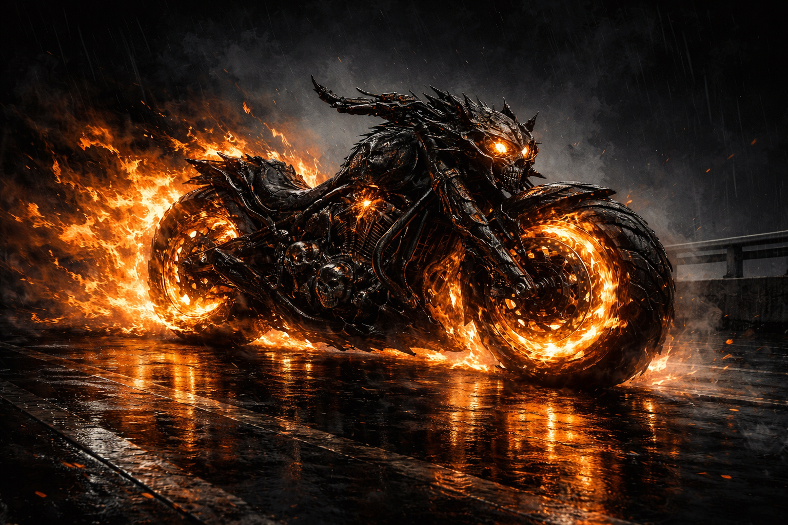
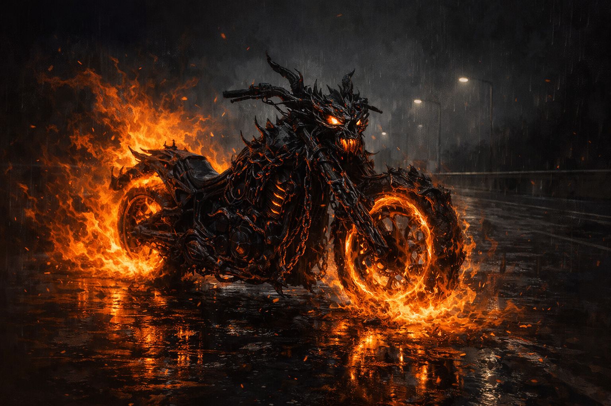
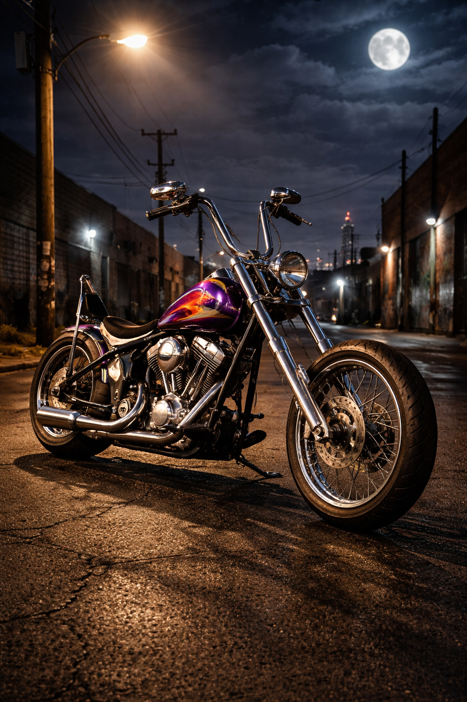
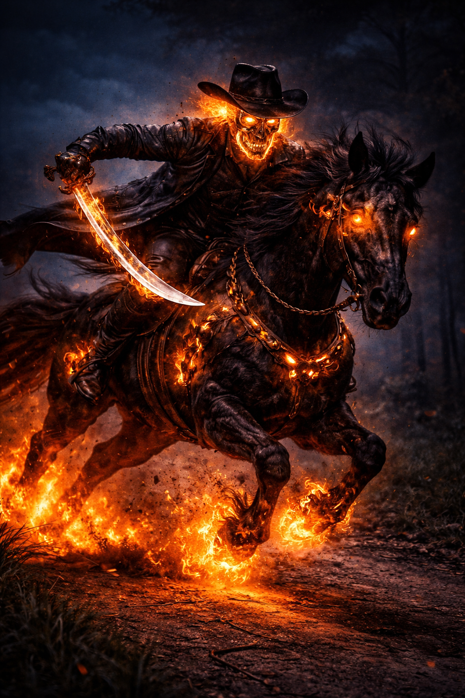

# Hellmounts — Vehicles and Creatures

> *"The horse stopped needing to eat around the second week. It stopped needing to sleep around the fourth. By the sixth week, its hooves left scorch marks."*

---

## The Bond

Every Ghost Rider has a Steed — and it was never originally supernatural. It was whatever the Host was bonded to when the fire first came. A motorcycle. A horse. A car. A wagon. The Spirit of Vengeance seeps into it the same way it seeps into the Host, and the transformation is just as total. The Steed stops obeying physics. It stops needing fuel, food, or rest. It becomes an extension of the Rider's will — semi-sentient, loyal, and on fire.

The bond between Rider and Steed is genuine. The Hellcycle comes when Johnny calls. The Hell Charger has driven itself through walls to reach Robbie Reyes. Carter Slade's horse was wreathed in flame and galloped across the desert for a century without tiring. If destroyed, the Steed reforms. It cannot be permanently destroyed while the Spirit is bound to a Host. It will always come back.

---

## Canon Steeds

### The Hellcycle (Johnny Blaze / Danny Ketch)

The most iconic version. Johnny Blaze's personal motorcycle — a beat-up chopper, nothing special — transformed the night Zarathos first possessed him. It no longer has a fuel system. The engine block matches no known make. The tires are not rubber. A mechanic examining it determines it is mechanically impossible.

At speed, the Hellcycle leaves a Trail of Hellfire — a wall of empyreal flame, 10 ft. wide, 15 ft. tall, persisting for one minute. The wheels burn with empyreal fire at all times. Its true speed is supernatural and effectively unlimited — canonically described as faster than Thor's thrown Mjolnir. For overland purposes: 500 mph with no fuel, no maintenance, no terrain penalty. It can cross a continent in hours.

Danny Ketch's version is visually distinct (sleeker, more modern) but functionally identical. The power comes from the Spirit, not the make and model.

*Johnny's mundane form — a 1969 chopper that doesn't need gas and started itself last Tuesday.*

### The Hell Charger (Robbie Reyes)

A 1969 Dodge Charger. Robbie was dying in the driver's seat when his uncle Eli Morrow's ghost bonded to him through the car. The Hell Charger can create portals by driving through walls, is essentially indestructible, and is wreathed in flame when Robbie transforms. It proves the concept works for any vehicle — the Spirit doesn't care what it's transforming. It cares about the bond.

### The Phantom Rider's Horse (Carter Slade)

The original. A living horse, wreathed in empyreal fire, galloping across the Old West. Carter's horse proves the bond predates the combustion engine entirely. Any creature bonded to the Host at the moment of first transformation becomes the Steed — horse, griffon, dire wolf, war elephant. The fire doesn't discriminate.

### The Ghost Flyer (Kenshiro Cochrane, 2099)

A flying motorcycle from the future. Proves the concept adapts to any era's technology. The Spirit uses whatever is available.

*A spectral warhorse — the original Hellmount, before motorcycles existed.*

---

## Our Adaptation — The Infernal Steed

In the Spirit of Vengeance class, the Host chooses their mount or vehicle at level 1 as part of starting equipment. It can be anything: a horse, a motorcycle (if the setting allows), a griffon, a dire boar, a wagon. Whatever it is, the Spirit begins transforming it at level 3.

The class upgrades **stack with** the base mount's existing abilities. If the player chose a Griffon, it keeps fly and pounce. If they chose a 3PP motorcycle, it keeps Thundering Crash. The class adds on top.

| Level | Name | Upgrade |
|-------|------|---------|
| 3 | **The Turning** | No food, water, fuel, or rest. Never tires. Mechanically impossible. |
| 8 | **The Quickening** | +20 ft. speed. Cross water and climb walls for up to 1 round. |
| 14 | **The Burning** | **Hellfire Leap:** Jump up to 10× move speed, move action, no check. Vertical = half horizontal. No fall damage. |
| 20 | **The Unchaining** | Leap unlimited (DM discretion). Water/walls indefinitely. *Dimension door* 1/day. Hellfire Backlash covers mount. |

**No flight.** The Infernal Steed does not fly. It jumps. It drives up walls. It crosses water. But it does not sprout wings. This is canon — the Hellcycle is not an airplane.

**Mount is defensive, not offensive.** The mount does not channel empyreal damage through its own attacks. Things that HIT the mount take Hellfire Backlash damage (level 18+), but the mount's claws/hooves/wheels deal normal damage only.

**No pounce off a Leap.** Hellfire Leap is a move action, not a charge. A mount cannot pounce at the end of a Leap.

---

*"It comes when called. Walls are optional. It's coming."*
