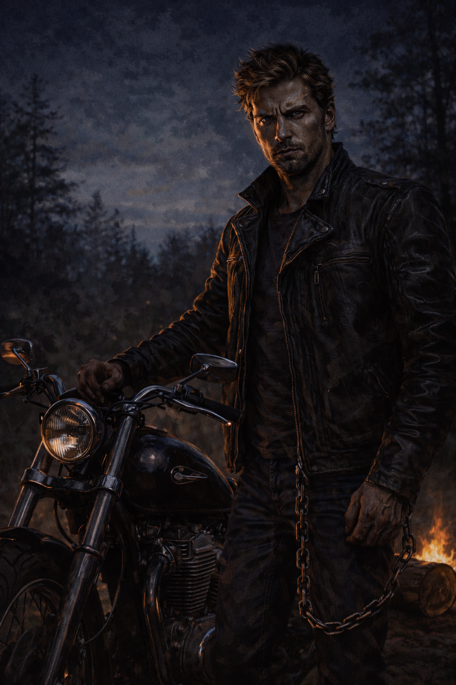
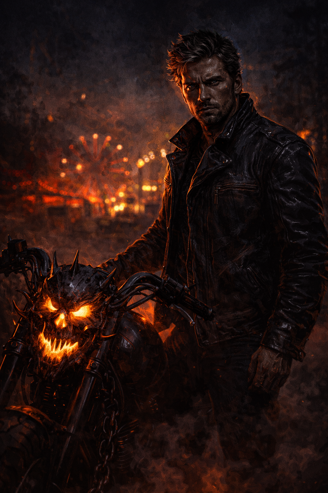
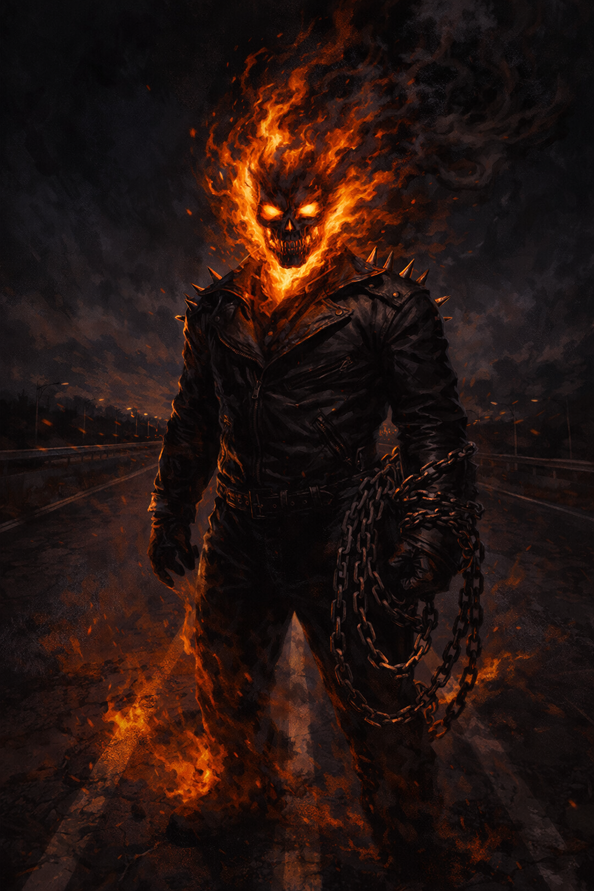
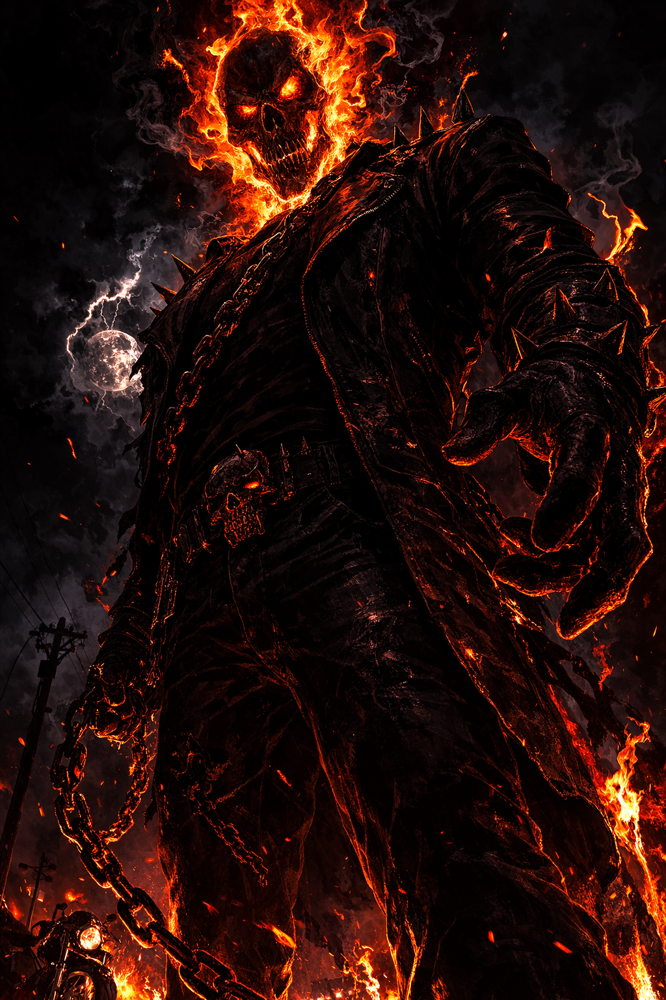
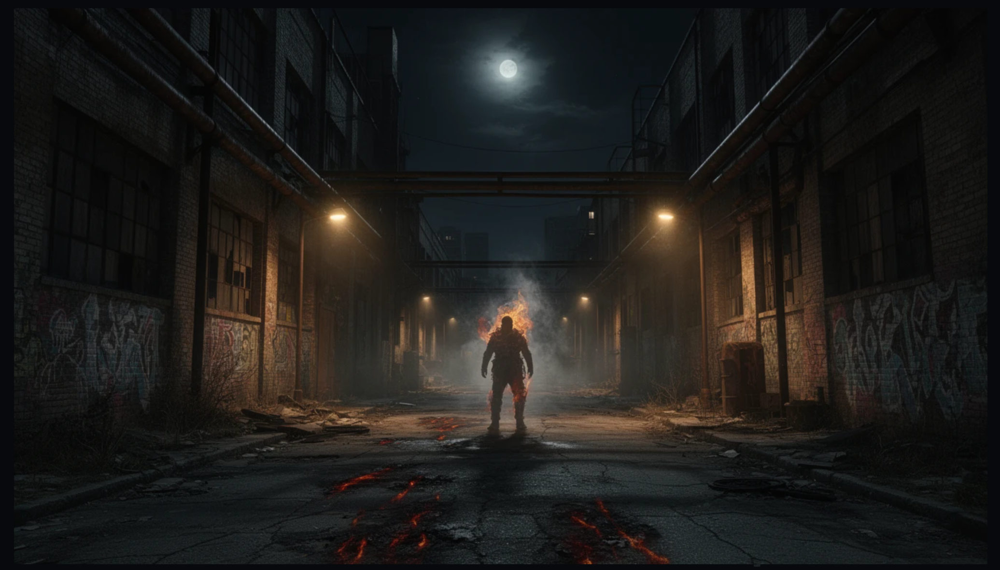
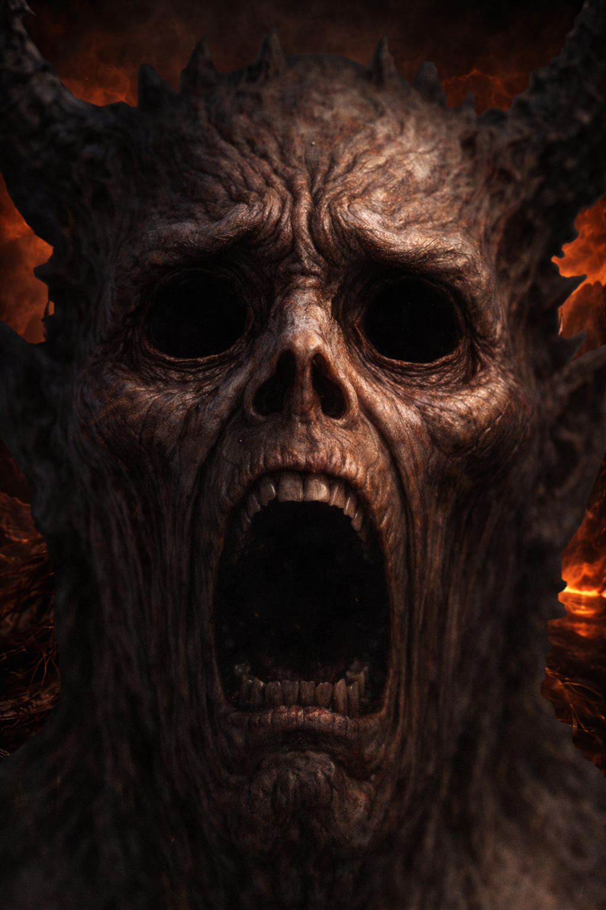
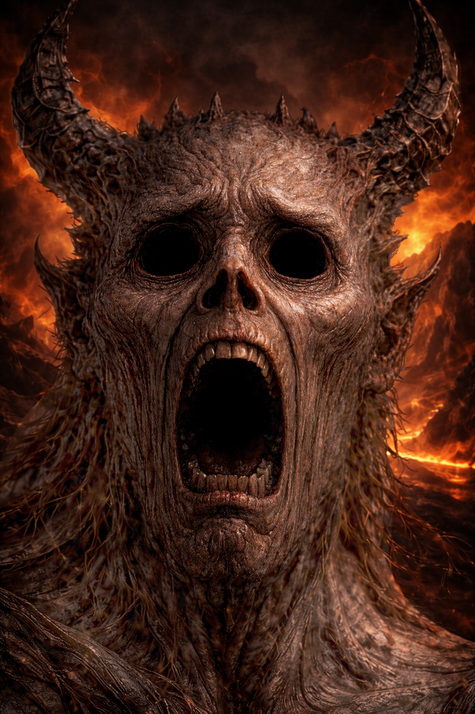
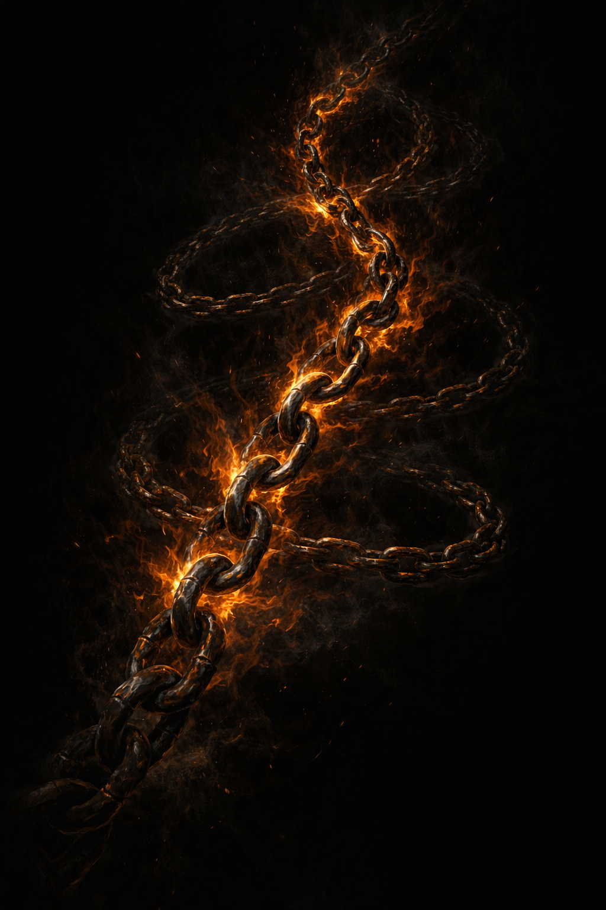

# Ghost Rider Campaign — Image Gallery

*All campaign images. Embed anywhere with ``.*

---

## Johnny Blaze

*Johnny Blaze — blonde biker, leather jacket, motorcycle, forest night. Primary portrait.*

*Johnny Blaze with the Hellcycle — carnival background. Transformation scene.*

*Johnny's 1969 mundane chopper — purple and flame custom paint, urban alley night.*

*Johnny mid-transformation — the Rider breaking through.*

---

## Ghost Rider

*Ghost Rider standing on road — orange flame skull, chain at side. Primary portrait.*

*Ghost Rider imposing full figure — fiery chain, dark background. Combat portrait.*

*Ghost Rider atmospheric — distant figure in dark alley, moonlight. Scene-setting.*

*Ghost Rider — additional combat reference.*

*Penance Stare — Ghost Rider skull close-up, orange nebula eyes. Comic panel style.*

---

## Zarathos

*Zarathos unbound — blue-flame skull, large figure, chain, hellscape. Primary portrait.*

*Zarathos portrait — the ancient fire.*

*Zarathos in blue-white flames — full divine manifestation.*

---

## Existential Dread Victims

*Tier 2–3 victim — bark-skinned screaming face, no horns, fire background.*

*Tier 4 victim — horned demonic screaming face, hellscape background.*

---

## The Hellcycle

*Hellcycle — skull front, rain, orange fire wheels. Action portrait.*

*Hellcycle — side view, spiky demonic chassis, rain. Secondary portrait.*

---

## The Hellfire Chain

*Hellfire Chain — glowing chain on black, orange fire along links.*

---

## The Hellfire Shotguns

*Winchester 1887 — hellfire veins in wood and metal, resting on leather. Artifact portrait.*

*Ghost Rider firing shotgun — dynamic action, alley, rain.*

*Ghost Rider with shotgun — secondary action reference.*

---

## The Sword of Uri-El

*Lahat HaCherev — blue flame longsword, black background, runic crossguard. Artifact portrait.*

*Uri-El — chained figure from behind, wielding blue-flame sword, stone wings.*

---

## Heaven & the Divine Commission

*Heaven's Gate — golden arch in clouds, angelic halos. The Empyrean.*

---

## Demon Lords & Scaling Reference

*Demon lord reference — CR 26–30 tier scaling target for Penance Stare design.*

---

## PF1E Reference Charts

*PF1E Strength reference — comparative STR scores across creature types.*

*Strength chart 0–60 — full range visualization for stat block verification.*

---

## File Reference

| Filename | Subject | Primary Doc |
|---|---|---|
| `Johnny_Blaze1.png` | Johnny portrait | `johnny-blaze-complete-character-document.md` |
| `Johnny_Blaze2_hellcycle.png` | Johnny + Hellcycle | `johnny-blaze-complete-character-document.md` |
| `Johnny's_1969_Raodster.png` | Mundane chopper | `the-hellcycle.md` |
| `Ghost Johnny2.png` | Mid-transformation | `johnny-blaze-complete-character-document.md` |
| `Ghost_Rider.png` | GR portrait | `ghost-rider-johnny-blaze.md` |
| `Ghost_Rider2.png` | GR combat | `ghost-rider-johnny-blaze.md` |
| `Ghost_Rider3.png` | GR reference | `canon-deep-dive.md` |
| `GR_Haunt.jpg` | GR atmospheric | `dm-and-player-guide.md` |
| `Penance_Stare.jpg` | Penance Stare eyes | `penance-stare-design-reference.md` |
| `Zarathos.png` | Zarathos unbound | `zarathos-spirit-of-vengeance.md` |
| `Zarathos_portrait.png` | Zarathos portrait | `canon-deep-dive.md` |
| `Zarathos in blue-white flames.png` | Zarathos divine form | `zarathos-spirit-of-vengeance.md` |
| `Existential_Dread_Husk.png` | Dread victim Tier 2–3 | `existential-dread-mechanic.md` |
| `Existential_Dread3.png` | Dread victim Tier 4 | `existential-dread-mechanic.md` |
| `Hellcycle1.png` | Hellcycle action | `the-hellcycle.md` |
| `Hellcycle2.png` | Hellcycle side | `the-hellcycle.md` |
| `Hellfire_Chain.png` | The Chain | `the-hellfire-chain.md` |
| `Hellfire_Shotgun.png` | Winchester 1887 | `the-hellfire-shotgun.md` |
| `Hellfire_Shotgun_w-GR.png` | GR firing | `the-hellfire-shotgun.md` |
| `Hellfire_Shotgun_w-GR2.png` | GR + shotgun action | `the-hellfire-shotgun.md` |
| `Lahat.png` | Sword of Uri-El | `the-sword-of-uri-el.md` |
| `Uri-El1.png` | Uri-El angel | `the-sword-of-uri-el.md` |
| `Heavens_Gate.png` | Heaven's Gate | `the-sword-of-uri-el.md` |
| `Random_Demon_Lord.png` | Demon lord reference | `penance-stare-design-reference.md` |
| `pf1e_str_reference.svg` | STR reference chart | `stat-block-audit.md` |
| `str_chart_0_60.svg` | STR chart 0–60 | `stat-block-audit.md` |
