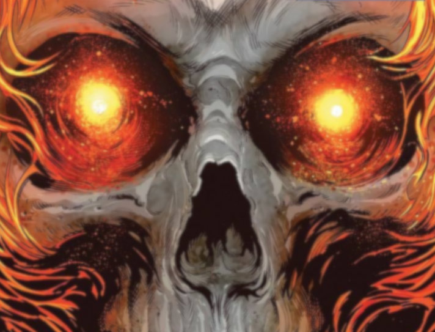
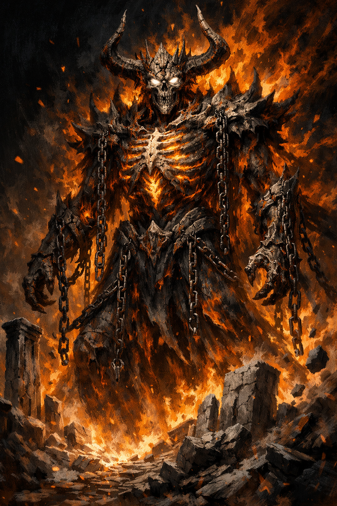

# Penance Stare



> *"Look into my eyes. Your souls are stained by the blood of the innocent. Feel their pain."*

---

## Canon

The Penance Stare is Ghost Rider's signature ability and the single most feared power in his arsenal. It requires eye contact — voluntary or forced. Once the lock is established, the target relives every pain they have ever inflicted on any being, physical, emotional, and spiritual, simultaneously and in totality. The experience is compressed into seconds of subjective time but feels like an eternity to the target. Mortals are typically destroyed in a single round. Demon lords endure longer — not because they resist it, but because they have more to answer for.

The canonical limitations are few but absolute. The Stare requires a soul to function. Blackheart famously resisted it because he had no soul — *"Your Penance Stare won't work on me. I've no soul to burn."* He was right. It's the only defense that works. Constructs, the genuinely innocent, and the soulless are completely immune. Everything else — every creature that has ever made a choice that caused harm — has something for the fire to find.

The Stare does not detect alignment. It detects *guilt* — the weight of specific acts. A Lawful Good paladin who burned a village in wartime glows with that village. A Chaotic Evil demon that has somehow never personally harmed an innocent burns dimly. This distinction is foundational. Ghost Rider cares about what you've DONE, not what you ARE.

In the comics, the Stare has rendered mortals catatonic in seconds, driven demons mad, and made cosmic entities flinch. Against Mephisto's proxies it is devastating. Against Mephisto himself — the Stare finds plenty to burn, but the Lord of Lies has 21 millennia of practice at compartmentalizing. He endures. He doesn't enjoy it.

---

## PF1E Adaptation — Two Versions

We built two versions: a flat-DC system for the CR 19/26 NPC stat blocks (Package 5), and a scaling progression for the leveling class.

**Key adaptation decisions:**

**DC 40 flat for the NPC version.** Derived from exhaustive math across eight design packages and nine target tiers (from CR 5 mortals to CR 60 Greater Deities). DC 40 sits at the natural inflection point of the PF1E Will save curve — mortals are far below it, Demon Lords straddle it, deities are comfortably above it. One DC, one damage die, no tiers. Hits all nine design targets cleanly.

**Success damage = 1 flat (not 1d4).** The single most important tuning lever at the deity tier. The difference between 1d4 and 1 on a successful save is irrelevant to mortals (they almost never succeed) but completely dominant for Greater Deities (95% of their rounds are success rounds). One die type changes Greater Deity survival from 16 rounds to 31 rounds. This is the whole ballgame.

**The leveling class uses 10 + 1/2 level + CHA.** DC 40 doesn't work for a level 10 Host with CHA 18 — that's DC 19, not 40. The class progression tells a story: at 3, "I can scare you." At 15, "I can break your mind." At 17, "And you can't look away." At high levels, the success effects (Shaken + 1 Wis/round grind) become the workhorse, not the fail effects. The Stare becomes a siege weapon, not a kill shot.

---

## CR 19/26 NPC Version (Package 5 — Locked)

**DC 40** (both Ghost Rider and Zarathos). Soul-based Will save.

**Contact:** Opposed Intimidate to force eye contact; voluntary = immediate lock.
**Judgment Lock:** Paralyzed once contact established. Only physical intervention (creature stepping between) or Ghost Rider's choice ends it.

| | Ghost Rider | Zarathos |
|---|---|---|
| Fail damage | 4d4 Wis/round | 5d4 Wis/round |
| Success damage | 1 Wis flat | 1 Wis flat |
| At Wis 0 | Catatonic. Soul consumed. | Same. |
| Recovery | DC 45 Heal (9th-level divine) or miracle/wish only | Same |

### Rounds to Catatonic by Target Tier

| Target | CR | Wis | Will | P(fail) | Rounds |
|---|---|---|---|---|---|
| Street mortal | 5 | 10 | +3 | 95% | **~1** |
| Veteran | 10 | 11 | +5 | 95% | **~1** |
| Master caster | 15 | 20 | +15 | 95% | **~2** |
| Elite caster | 21 | 26 | +22 | 85% | **~3** |
| Demon Lord (high) | 30 | 34 | +35 | 20% | **~12** |
| Demigod | 37 | 36 | +36 | 15% | **~15** |
| Lesser Deity | 42 | 38 | +45 | 5% | **~26** |
| Intermediate Deity | 50 | 44 | +53 | 5% | **~30** |
| Greater Deity | 60 | 45 | +62 | 5% | **~31** |

Mortals die in 1–3 rounds. Demon Lords endure 10–15. Deities survive 25–31 but feel every round. The success damage (1 flat) is what keeps the pressure on even when the target makes every save.

---

## Leveling Class Version — Penance Progression

**DC:** 10 + 1/2 class level + CHA mod.
**Uses/day:** 3 + CHA mod.
**Restriction:** Only works on souled creatures that have committed evil acts.

| Level | Ability | On Failed Save | On Successful Save |
|-------|---------|----------------|-------------------|
| 3 | Penance Glare | Shaken 1d4 rds | Uneasy (no effect) |
| 7 | Penance Gaze | Frightened 1d4 rds | Shaken 1 rd |
| 10 | Penance Stare | Panicked 1d4 rds + 1d2 Wis | Shaken 1d4 rds |
| 15 | Greater Stare | Paralyzed 1 rd + 1d4 Wis/rd | Shaken 1d4 rds + 1 Wis flat |
| 17 | Penance Lock | As Greater; cannot break eye contact | — |

**Penance Lock:** Only physical intervention or Host's choice ends it. The nat-20 escape hatch from Existential Dread does NOT apply to the Host's own Lock.

**Penance → Medallion:** At Wis 0, soul auto-absorbed by Medallion if space available.

### High-Level Note

At level 15+, the Greater Stare's fail effect (Paralyzed + heavy Wis damage) rarely lands against high-Will outsiders. DC 21 vs +18 Will = 10% fail. The success effect — Shaken 1d4 rds + 1 Wis flat per maintained round — is the workhorse. The fear chain (Cornugon Smash → Shatter Defenses → flat-footed) does the rest. Hold the stare. Grind the Wisdom. The Stare is a siege weapon at high levels, not a kill shot.

---

## Core Math Reference

All fail rates use PF1E d20 resolution:

```
P(fail) = clamp( DC − Will − 1,  min=1, max=19 ) / 20
```

Natural 1 always fails (5% floor). Natural 20 always succeeds (5% ceiling).

```
E[dmg/round] = P(fail) × avg_fail_dmg  +  P(success) × avg_success_dmg
Rounds to catatonic ≈ Wis Score / E[dmg/round]
```

### Tuning Levers

| Change | Low Tiers | Mid Tiers | Deity Tier |
|---|---|---|---|
| Raise DC +5 | Negligible (already 95%) | ↓ ~30% rounds | May unlock tier |
| Raise fail dmg +2 avg | ↓ proportionally | ↓ proportionally | Negligible (5% fail) |
| **Raise success dmg +1** | **Negligible** | **Minor** | **Major ↓ at deity tier** |

Success damage is the single most impactful lever at the deity tier. Nobody ever talks about it.

---



*"Your Penance Stare won't work on me. I've no soul to burn."*
— Blackheart. He was right. It's the only defense that works.
