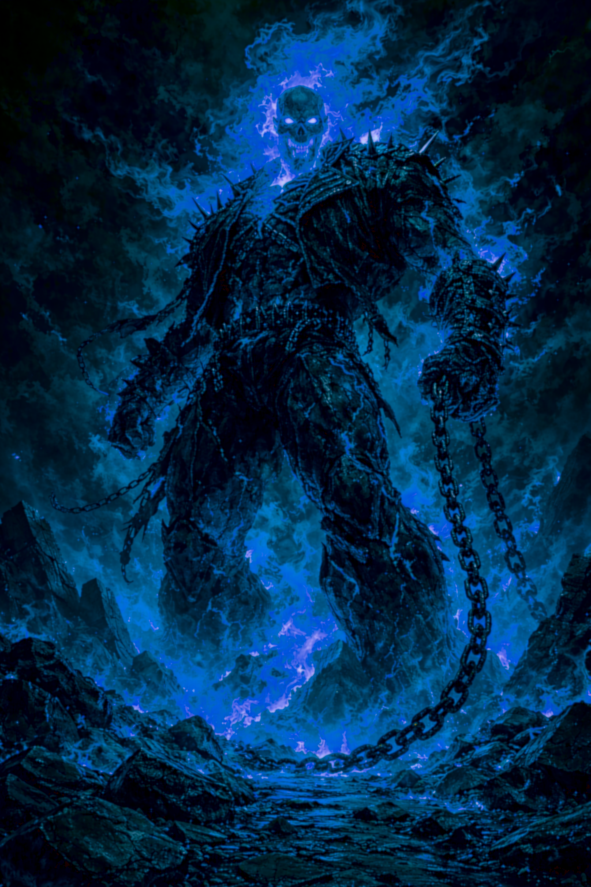
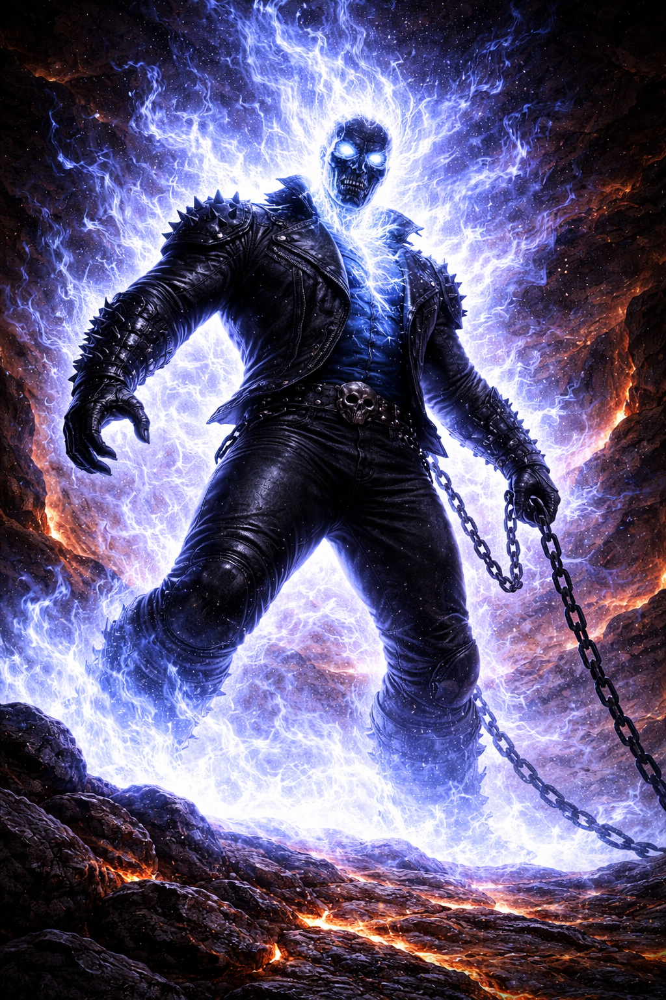

# Spirits of Vengeance

> *"When Zarathos takes possession of the Ghost Rider, the Ghost Rider's powers are, for most intents and purposes, boundless and godlike."*
> — Doctor Strange

---

## What They Are

The Spirits of Vengeance are among the oldest entities in the Marvel cosmos. They predate the angelic-demonic divide — they existed before the concepts of "angel" and "demon" had fully separated in the cosmic hierarchy. They were created as divine instruments of justice, sent to protect the world of men. They are not demons, though they wear the skin of damnation. They are not angels, though they carry heaven's flame. They are judgment itself, given form and purpose.

The Medallion of Power was forged by the ancient cult known as The Blood to house the Spirits. Mephisto coveted the Medallion because it was the key to controlling them — with it, he could bind Spirits to human hosts. Without it, they were free agents answering to no one but the highest divine authority. The Medallion became both the instrument of imprisonment and the mechanism of the bond.

Each Spirit has its own personality, its own history, and its own relationship with its Host. Some are ancient and alien. Some were human once. What they share is the fire — empyreal flame, divine judgment that burns the soul of the guilty and passes through the innocent.

---

## Notable Spirits

### Zarathos — The Ancient Fire

Zarathos is the most powerful Spirit of Vengeance. He is 21,000 years old at minimum, having possessed hosts across every civilization in human history. He was an angel of justice — a Spirit of Justice, specifically — before Mephisto trapped him, stole his memories, and drove him mad across millennia of imprisonment in human hosts.

Zarathos is not evil in the way a demon is evil. He is *amoral* in the way a wildfire is amoral. He is vengeance without mercy — the mechanism, not the motive. He targets the most guilty creature in range. Everything else is scenery. A pickpocket gets slapped. A murderer gets the full treatment. A soul-eating demon gets torn apart with bare hands while Zarathos quotes scripture in a language that hasn't been spoken in ten thousand years.

His Wisdom is intentionally low compared to his power tier. He is primordial destructive force, not wisdom or judgment. This is the weakness Mephisto exploited — using a soulless creature (Centurious) as a proxy, because Zarathos's soul-based powers are useless against the soulless. He can be tricked, trapped, redirected. He was enslaved because he couldn't perceive the trap. He is the ancient fire. He is not the ancient *mind*.

The line that defines him: *"I never needed Blaze. I never needed him. I... I need him."* He has been in Johnny Blaze so long that the two are genuinely interdependent. Without a soul to anchor him, Zarathos begins to die.

### Noble Kale

A Spirit of Vengeance distinct from Zarathos. Kale was a human in life — a member of the Kale family line — who became a Spirit after death. He was bonded to Danny Ketch. Noble Kale is more *present* than Zarathos — where Zarathos is ancient and alien, Kale remembers being human and brings that perspective to the bond. His version of the Ghost Rider can heal damaged souls, a power Zarathos does not grant. The archangel Uri-El personally intervened in a dispute between Mephisto and Kale over the terms of the bond — nearly triggering a war between Heaven and Hell.

### Eli Morrow

Not technically a Spirit of Vengeance at all. Eli was a human serial killer — Robbie Reyes's uncle — whose ghost was trapped in a 1969 Dodge Charger. When dying Robbie made contact with the car, Eli's ghost bonded to him. Eli is human evil, not divine judgment. He whispers terrible things. He wants to kill. Robbie fights him constantly. The "Ghost Rider" power Robbie wields may not be empyreal at all — it may be something else entirely, powered by human rage and guilt rather than divine commission. This makes Robbie's situation fundamentally different from Johnny's or Danny's.

### The Spirit (unnamed)

Alejandra Jones's version of the Spirit — which may or may not be Zarathos, depending on continuity. This version demonstrated abilities (weather manipulation, teleportation) that Johnny's bond with Zarathos never produced, suggesting either a different Spirit or the same Spirit expressing differently through a different personality.

---

## The Soulless Bane

Every Spirit of Vengeance shares one weakness: they cannot affect the soulless. A creature with genuinely no soul — not undead (which have damaged souls), not evil (which have corrupt souls), but truly *absent* of soul — renders all soul-based abilities useless. The Penance Stare finds nothing. The empyreal fire finds nothing to burn. The Spirit's perception goes blank.

This is how Mephisto enslaved Zarathos. He used Centurious, a being who had literally sold the last fragment of his soul, as a proxy. Zarathos couldn't perceive him, couldn't affect him, and was trapped before he understood what was happening. The Soulless Bane remains the hard counter for any Spirit of Vengeance.

---

## Our Adaptation — The Zarathos Surge

In the Spirit of Vengeance class, the Spirit is Zarathos by default (though DMs may substitute another Spirit for different campaign flavors). The Spirit manifests in two ways: as the passive power behind the transformation (Rider's Mantle), and as the entity that takes over when the Host loses control (Zarathos Surge).

**The Surge** is the DM taking full control of the character. No stat block. No numbers. Zarathos is as strong as the scene requires. The user who designed this class directed: *"He's the big brother of all demon lords, empyreal lords, and Great Old Ones. He can open any size can of whoop-ass. He IS Justice incarnate."*

**Surge Triggers:**
- The Host drops to 0 HP while transformed (automatic — Cheat Death from the Medallion prevents this)
- Overburn failure (pushed past the daily round limit and failed the escalating Will save)
- Hellfire Instability roll #1 (the "GUILTY" entry on the d100 table)
- Overwhelming evil or trauma (DM invocation, Will DC 22 + souls stored)
- Medallion at maximum capacity (Will DC 15 + Medallion AC bonus, each round of combat)

**Duration:** 1d4+1 rounds. Each round past that: DC 20 Will to end. Success = over. Fail = one more round.

**Aftermath:** Transformation ends. Host is exhausted 10 minutes. Cannot transform 1 hour. Medallion emptied — all souls consumed by Zarathos. All accumulated overburn damage hits at once. This can kill.

**At level 19 (Unbound):** Overburn no longer triggers surge. At level 20 (Spirit Unchained): voluntary surge with shared DM/player control.

**Play Zarathos as:** Single-minded (targets the most guilty), disproportionate (a murderer gets the full treatment), unpredictable (might walk three blocks toward the REAL evil nobody knew about), and brief (the surge should feel like a storm passing).

---

*"There are some things worse than death. And now I rule over them all."*
