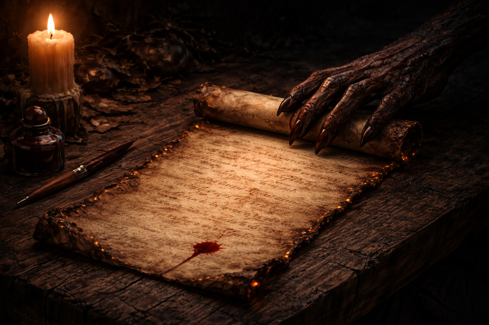

# The Contract

> *"No. I'm gonna own this curse. And I'm gonna use it against you. Whenever innocent blood is spilt, it'll be my father's blood... and you'll find me there. A spirit of vengeance... fighting fire with fire."*
> — Johnny Blaze

---

## Canon

The deal is always the same. Someone desperate, someone young, someone willing to trade everything for one person they love. Johnny Blaze was seventeen years old when Mephisto came to him. Crash Simpson — stunt rider, surrogate father, the only family Johnny had left — was dying of cancer. Mephisto offered a cure. Johnny signed in blood. Some versions say literally. Some say by accident. All versions agree: it was binding.

Mephisto cured the cancer. Then Crash Simpson died in a motorcycle stunt the next day. Mephisto's contracts are technically flawless. He never promised Crash wouldn't die — he promised the cancer wouldn't kill him. The devil doesn't lie. He doesn't need to. The fine print does the work.

The night Crash died, the fire came. Zarathos — the Spirit of Vengeance that Mephisto had trapped millennia ago — was bound to Johnny's soul through the Medallion of Power. The transformation was immediate and total. Johnny's flesh burned away. His skull caught fire. The motorcycle caught fire. Everything caught fire. And the Rider walked the earth again.

Here's where it gets interesting. Mephisto made the contract. But the bond between Host and Spirit was later sealed by something higher — the archangel Zadkiel and, depending on the continuity, the One Above All (Marvel's God-equivalent). The contract was originally Mephisto's mechanism to control the Spirit of Vengeance through a human intermediary. But the divine seal transformed it into something Mephisto can no longer alter. The contract exists. It is binding. But Mephisto cannot change its terms, cannot break the bond, cannot reclaim the Spirit. He is limited to loopholes, lies about facts, and proxies.

Johnny has been to Hell three times. He walked out twice on his own power. The third time, an angel opened the door. He briefly served as King of Hell using Zarathos's authority — not because he wanted to, but because someone had to sit in the chair, and Johnny Blaze was the only person in Hell that Hell itself was afraid of.

The deal cost Johnny everything and gave him something he never asked for. He lost his father. He lost his freedom. He lost his humanity, one transformation at a time. What he got in return was the power to ensure that what happened to him — a devil preying on a desperate kid — would never happen to anyone else without consequence.

---

## PF1E Adaptation — Contract Immunity

At level 7, the Host gains **Contract Immunity**. This is a hard narrative rule — no numbers, no saves. The original design had a three-layer mechanical system (+8 Will bonus, −10 manipulation penalty, plus the hard rule). The user cut it to just the hard rule: *"Nothing else is canon. Once the contract is sealed, that's it."*

**The rule:**

The bond between Host and Spirit is sealed by the highest divine authority in the setting. The contract cannot be altered or broken by anyone short of that authority. The Host cannot be forced to harm innocents — reality intervenes if necessary, entropy retaliates against the schemer. Geas/quest from evil outsiders auto-fail. Infernal, abyssal, and fey contracts targeting the Host are void on contact.

**The limitation:**

The Host CAN be tricked about facts. Contract Immunity protects the Host's *nature* — their bond, their values, their purpose. It does not protect their *knowledge*. A devil can lie about who is innocent. A demon can disguise itself as a victim. A fey lord can construct an elaborate scenario where the "right" choice is actually the wrong one. The Host's judgment can be fooled. Their contract cannot be broken.

This mirrors Mephisto's position in canon exactly. He cannot alter the bond. He cannot force Johnny to serve. But he can lie, manipulate, and scheme — and he's had 21,000 years of practice.

---

## What Contract Immunity Is Not

It is not a saving throw bonus. It is not a spell effect. It is not dispellable, suppressible, or counterable. It is a statement of cosmological fact: the bond is sealed by the highest authority, and nothing below that authority can touch it.

At the table, this means the DM should never present a scenario where a save or check determines whether the contract holds. The contract always holds. The interesting question is never "can the devil break the bond?" — it's "can the devil trick the Host into *thinking* the bond is already broken?"

---

*"The devil offered him a contract. The ink caught fire before the pen touched paper."*
