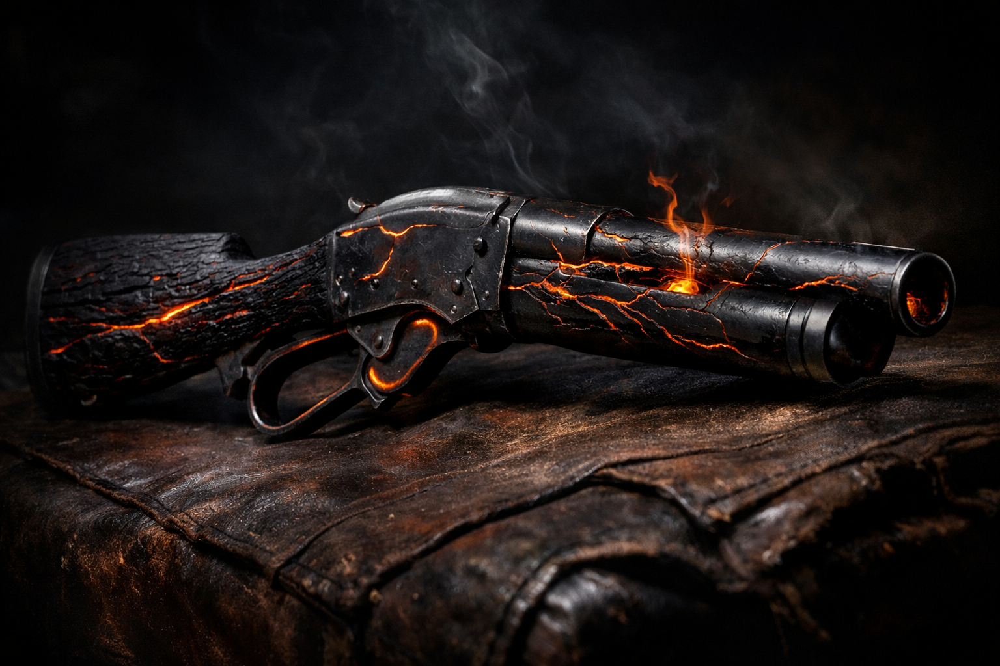
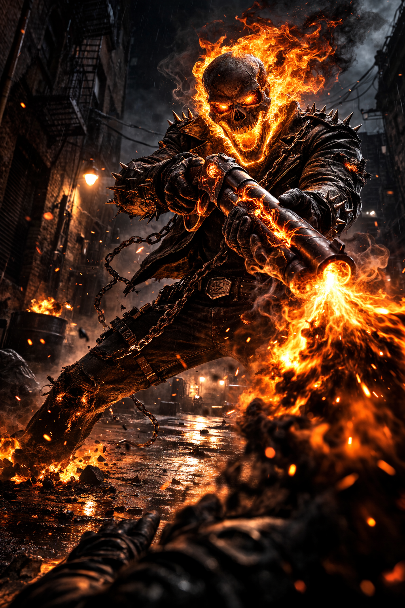
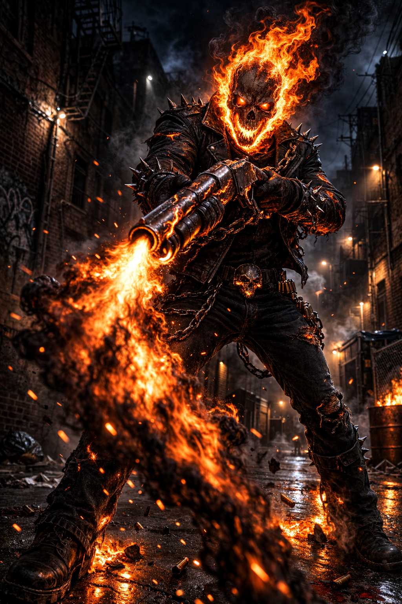

# The Hellfire Shotgun

> *"He reached behind his back. There was no holster. There was no sheath. The guns were just there."*

---

## Canon

**Comics (Ghost Rider vol. 3 #14, June 1991):** Johnny Blaze was carrying an ordinary shotgun during a confrontation with Danny Ketch's Ghost Rider. When Ghost Rider grabbed the weapon, his hellfire passed through it and permanently transformed it into a hellfire-channeling artifact. The power was later revealed to emanate from within Johnny himself — the gun is a conduit for Blaze's own suppressed hellfire potential, not an independent power source. This is why it works specifically and unusually well in his hands and becomes supercharged in Ghost Rider form: the human intermediary is removed, and the full fire flows through.

**Film (Ghost Rider, 2007):** A Winchester Model 1887 lever-action shotgun given to Johnny by Carter Slade (the Caretaker) before the final confrontation with Blackheart. Johnny thrust the weapon into shadow and it transformed — the hellfire within him channeling up through the steel and igniting the shells.

Both weapons appear when needed — Johnny reaches behind his back and they are there. No sheath, no holster, no explanation. The ammunition is unlimited: the guns conjure their own empyreal rounds. They cannot be emptied. In anyone else's hands, they are inert — non-magical sawed-off shotguns, cold and ordinary.

Johnny carries two. The Winchester Model 1887 (lever-action, sawed-off, the film version) fires twice per round. The Remington 11-87 (semi-automatic, sawed-off, pistol grip, brass-cased bandoliers — the comics version) fires four times per round. Both are twelve-gauge. Both are brutal. Both smell of brimstone and scorched parchment when fired, and the muzzle blast burns orange-black — the same impossible color as Ghost Rider's eyes.

The physical description: the wood of the stock is scorched black from the inside out — not burned, but *changed*, as if the grain reorganized itself around something that no longer cares about being wood. The metal is darkened with thin veins of hellfire tracing along it like glowing cracks. In Ghost Rider's hands the transformation completes: wood chars and splits away, metal runs with lines of hellfire, and the barrel glows forge-hot. It is clearly no longer a gun. It is a divine instrument shaped like one.

**Motorcycle Conjuration:** A genuine canon ability, rarely discussed. Johnny can conjure a mundane motorcycle by pointing the shotgun at any open surface (1/day). Ghost Rider can conjure a full Hellcycle by firing a barrel at the ground (3/day). Danny Ketch's hellfire imprinted this ability on the weapon permanently.

---

## PF1E Adaptation

The Hellfire Shotgun exists in two forms: Johnny Blaze's version (channeling suppressed hellfire potential through a human body) and Ghost Rider's version (full divine power, no intermediary). Both are supernatural firearms requiring Exotic Weapon Proficiency (firearms) for Johnny — Ghost Rider's proficiency is inherent to his divine office.

**Key adaptation decisions:**

**Two stat blocks, one weapon.** The gun doesn't change. Johnny changes. The same shotgun in Johnny's hands deals 2d6+3 empyreal; in Ghost Rider's hands it deals 6d6 empyreal. The fire goes from "bleeding through" to "fully unleashed."

**Soul-Based Fear.** Every hit forces a Will save or shaken. Soul-based, not mind-affecting — bypasses fear immunity for souled creatures. Ghost Rider's version (DC 30) ties to the Existential Dread aura and stacks with it.

**Hellfire Revelation.** A hit forces the target to relive acts of harm. Johnny's version is a flash, a fragment. Ghost Rider's version is a sustained burn — 1d4 significant sins relived simultaneously. Not the full Penance Stare, but a warning shot of the soul.

**Inert without Blaze.** Keyed to Johnny's soul. Anyone else holds a non-magical sawed-off.

---

## Johnny Blaze's Version

| Property | Winchester 1887 | Remington 11-87 |
|---|---|---|
| Rate of fire | 2 shots/round (lever-action) | 4 shots/round (semi-auto) |
| Range | 30 ft. (touch attack) | 30 ft. (touch attack) |
| Attack | +7 touch | +7 touch |
| Damage | 2d6+3 empyreal/shot | 2d6+3 empyreal/shot |
| Fear DC | 16 | 16 |
| Ammo (Blaze) | Unlimited | Unlimited |
| Ammo (others) | 18 rounds | 18 rounds |
| Conjure motorcycle | 1/day (mundane) | 1/day (mundane) |

**Evil's Bane:** +1d6 empyreal vs evil. +2d6 vs demons specifically.

---

## Ghost Rider's Version

| Property | Value |
|---|---|
| Range | 60 ft. (touch — range doubles in GR's hands) |
| Attack | +22 touch |
| Damage | 6d6 empyreal/shot |
| Rate of fire | 2/round (Winchester) or 4/round (Remington) |
| Fear DC | 30 (soul-based, ties to Existential Dread) |
| Revelation DC | 30 (1d4 sins relived; fail = Frightened 1d4 rds) |
| Proficiency | None required (divine attunement) |
| Ammo | Unlimited, free-action reload |
| Hardness/HP | 25 / 60 (artifact-grade) |
| Conjure Hellcycle | 3/day (swift action, full supernatural Hellcycle) |

**Evil's Bane (Full):** +2d6 vs evil. +4d6 vs demons/devils. +6d6 vs demon lords and archdevils. A demon lord struck takes 6d6 + 6d6 = 12d6 empyreal per barrel.

**Point-Blank Soul Blast (within 10 ft.):** Both barrels, standard action, 8d6 empyreal (Ref DC 30 half). DC 30 Will or treated as if failing the initial Penance Stare contact check — immediately subject to Judgment Lock if Ghost Rider maintains gaze. The "I could do this the hard way or the harder way" option.

**Indestructible in Ghost Rider's Grip:** Cannot be sundered, disarmed, or destroyed by non-artifact means. Returns to Ghost Rider's hand on will if separated.

---

## Summary Comparison

| Property | Johnny | Ghost Rider |
|---|---|---|
| Damage/shot | 2d6+3 | 6d6 |
| Range | 30 ft. | 60 ft. |
| Fear DC | 16 | 30 |
| Evil bonus (demon lord) | +2d6 | +6d6 |
| Proficiency | EWP (firearms) | Inherent |
| Motorcycle | 1/day mundane | 3/day full Hellcycle |

---

*The power was always Johnny's. The gun was just waiting for the fire to stop being polite.*
