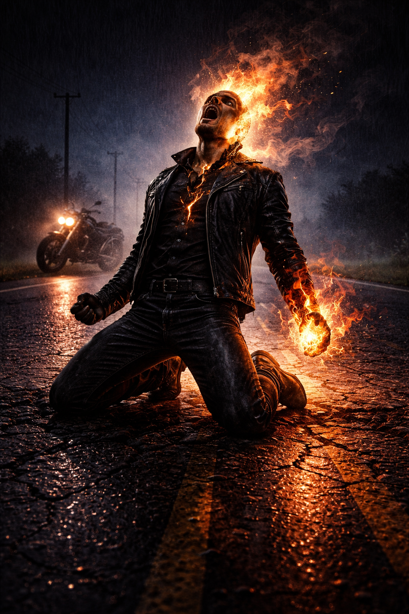

# The Host

> *"He may have my soul, but he doesn't have my spirit."*
> — Johnny Blaze

---

## What a Host Is

Every Ghost Rider has a Host — the human (or near-human) soul that anchors the Spirit of Vengeance to the mortal world. Without a Host, the Spirit has no form, no focus, and no restraint. It is raw divine fury with nowhere to go. The Host is the leash, the lens, and the conscience. They decide who deserves judgment and who deserves mercy. They decide when to transform and when to hold back. They are the reason Ghost Rider is something more than an engine of destruction.

The bond is rarely voluntary. Most Hosts are desperate, young, or unlucky — people who made deals they didn't fully understand, inherited burdens they didn't ask for, or were chosen by forces that didn't ask permission. The deal is always binding. The fire always comes. What the Host does with it after that is the story.

Being a Host is not a gift. It is a condition. The Spirit is always there — whispering, tempting, offering more power, more fire, more time. The Host can feel it in their chest like a second heartbeat. Their eyes glow orange-black when evil is nearby. They smell faintly of brimstone in warm weather. Animals don't like them. Children stare. Mirrors sometimes show the wrong face.

Most of the time, the Host is simply a person. They eat breakfast. They argue about tavern bills. They try to have normal relationships and mostly fail. Then innocent blood is spilled, and the thing inside them wakes up, and they stop being a person for a while.

---

## Notable Hosts

**Johnny Blaze** — carnival stunt rider, seventeen years old when Mephisto came. Made the deal to save his dying father Crash Simpson from cancer. Mephisto cured the cancer, then had Crash die in a motorcycle stunt the next day. The contract is technically flawless. Johnny has never forgiven himself for the wording. He is bonded to Zarathos, the most powerful Spirit of Vengeance — an entity 21,000 years old that Doctor Strange described as "godlike." Johnny holds it in check through sheer stubbornness. He's been to Hell three times. He walked out twice on his own. He briefly served as King of Hell. He holds nine Guinness World Records for stunt riding. He is, by any measure, the most successful Host in history — not because he's the most powerful, but because he's lasted the longest without losing himself.

**Danny Ketch** — Johnny's half-brother, bonded to Noble Kale. Danny's origin is more accidental — he touched the mystical gasoline cap of a motorcycle in a junkyard and the Spirit activated. Danny is generally depicted as more conflicted than Johnny — where Johnny fights the fire with anger and willpower, Danny questions whether the fire is right. Danny's Rider can heal damaged souls, a power Zarathos does not grant.

**Robbie Reyes** — East LA mechanic, teenager, bonded to the ghost of his serial-killer uncle Eli Morrow. Robbie's situation is unique: Eli is NOT a Spirit of Vengeance, he's a human ghost. Robbie's Ghost Rider is powered by a different engine than Johnny's or Danny's — human evil instead of divine judgment. His Steed is a 1969 Dodge Charger. He joined the Avengers.

**Alejandra Jones** — raised from childhood by a Nicaraguan cult specifically to be a vessel for the Spirit. Briefly bonded to Zarathos after Johnny lost him. Demonstrated abilities Johnny never showed — weather manipulation, teleportation — suggesting the Spirit expresses differently through different personalities.

**Carter Slade** — the Old West Ghost Rider. A Texas Ranger in the 1800s. His Steed was a flaming horse. He passed the mantle to Johnny in the 2007 film, riding one last time before disintegrating at dawn.

**Kenshiro "Zero" Cochrane** — the Ghost Rider 2099. A hacker who died and had his consciousness uploaded into a robot body. His "Spirit" is an AI based on Zarathos's patterns. His Steed is a flying motorcycle. He proves the concept adapts to any era.

---

## The Deal

The bond between Host and Spirit is sealed differently for each Rider. Johnny's was a Mephistophelean contract. Danny's was accidental contact with a mystic object. Robbie's was a dying boy's desperate plea answered by a ghost. Alejandra's was deliberate cult preparation. Carter Slade's origin varies by continuity.

What they all share: the bond is sealed by something higher than the entity that brokered it. Mephisto made Johnny's deal, but the archangel Zadkiel — and ultimately the One Above All — sealed it beyond Mephisto's power to break. The deal can't be renegotiated, altered, or dissolved by anyone below the highest divine authority. The Host cannot be forced to harm innocents. Reality intervenes if necessary.

---

## Our Adaptation — The Host in Play

In the Spirit of Vengeance class, the player IS the Host. They build a normal character — race, stats, feats, skills — and the class features are what happens when the Spirit activates. The transformation enhances what you built. It doesn't replace it.

**Starting Equipment — "Circus Refugee."** One masterwork weapon, one mount or vehicle, one set of armor up to medium. Not much else. The Host left their old life with what they were wearing.

**CHA matters.** The Host's defining stat is force of personality. CHA drives transformation rounds (Rider's Mantle), Penance DC, and Existential Dread. A Host who dumps CHA is building someone who can't control the fire. That's a valid choice and a dangerous one.

**Burning Judgment Eyes — always on.** Even in human form. The Host perceives evil as a constant low-grade weight. They see the world's sins the way other people see bad weather. At level 3, Sin Sight makes it worse — they see specific acts, not just alignment.

**The Host is the moral compass.** The Spirit wants to burn everything guilty. The Host decides who actually deserves it. Roleplay this. The tension between "the fire says burn them all" and "maybe this one deserves a second chance" is the core character drama.

---

*"I'm gonna own this curse. And I'm gonna use it against you."*
